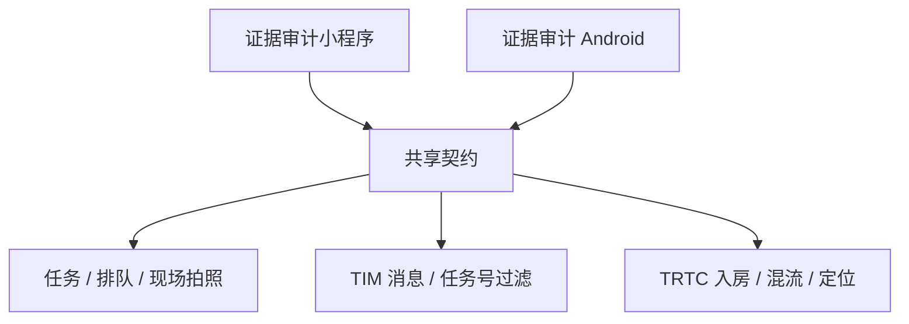
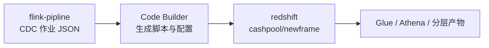
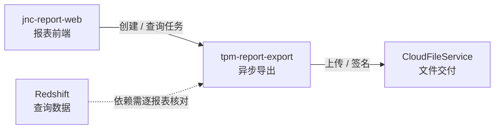

---
{"dg-publish":true,"dg-permalink":"project-relations","permalink":"/project-relations/","dg-note-properties":{"permalink":"/project-relations/","cssclasses":["wiki-page","wiki-article","wiki-index"]}}
---

[[index\|首页]] / [[01-导航与索引/项目总览\|项目导航]] / 关系图

# 项目关系图

看清跨端契约、数据加工与导出链路，判断一次修改需要同步检查哪些工程。完整项目清单和框架对照统一见 [[01-导航与索引/项目总览\|项目总览]]。

> [!wiki-nav] 本页导航
> [[01-导航与索引/项目关系图#业务分组\|#业务分组]] · [[01-导航与索引/项目关系图#直播审核\|#直播审核]] · [[01-导航与索引/项目关系图#后端与数据链路\|#后端与数据链路]] · [[01-导航与索引/项目关系图#报表导出\|#报表导出]] · [[01-导航与索引/项目关系图#修改影响\|#修改影响]]

## 业务分组

同组表示业务关联；接口调用关系在后面的链路图中单独说明。

| 业务 | 管理端 | 移动端 / 配套工程 |
| --- | --- | --- |
| Andromeda · SFA | [[02-Web端项目/andromeda-web\|andromeda-web]] | [[03-小程序项目/andromeda-wx\|andromeda-wx]] |
| DMS · 分销 | [[02-Web端项目/jnc-dms-web\|jnc-dms-web]] | [[03-小程序项目/jnc-dms-wx\|jnc-dms-wx]] |
| 稽核 | [[02-Web端项目/jnc-audit-web\|jnc-audit-web]] | [[03-小程序项目/jnc-audit-wx\|jnc-audit-wx]] |
| TPM · 管理与商户 | [[02-Web端项目/tpm-pc-manager\|tpm-pc-manager]] · [[02-Web端项目/jnc-tpm-web\|jnc-tpm-web]] · [[02-Web端项目/jnc-tpm-react\|jnc-tpm-react]] | [[02-Web端项目/tpm-merchant-wx\|tpm-merchant-wx]] |
| TPM · 证据审计 | [[02-Web端项目/tpm-pc-manager\|tpm-pc-manager]] | [[03-小程序项目/tpm-evidence-audit-wxapp\|tpm-evidence-audit-wxapp]] · [[04-移动端项目/tpm-evidence-audit-android\|tpm-evidence-audit-android]] |
| 报表与导出 | [[02-Web端项目/jnc-report-web\|jnc-report-web]] | [[10-后端与数据项目/tpm-report-export\|tpm-report-export]] · [[10-后端与数据项目/redshift\|redshift]] |
| 数据加工 | [[10-后端与数据项目/flink-pipline\|flink-pipline]] | [[10-后端与数据项目/redshift\|redshift]] |

订单、产品、权限、BSS、产供销及其他工程入口见 [[01-导航与索引/项目总览#Web 端项目\|Web 端项目清单]]。

## 直播审核

两个客户端共享任务、TIM 消息和 TRTC 参数；SDK 与页面状态的实现各自维护。

| 想查什么 | 入口 |
| --- | --- |
| 主流程、接口、TIM key、房间号与混流字段 | [[07-运维与发布/专项/直播审核知识地图\|直播审核知识地图]] |
| 小程序页面与实现 | [[03-小程序项目/tpm-evidence-audit-wxapp\|tpm-evidence-audit-wxapp]] |
| Android 页面与实现 | [[04-移动端项目/tpm-evidence-audit-android\|tpm-evidence-audit-android]] |
| 后端对接文档 | [[05-文档项目/liveup-doc\|liveup-doc]] · [[07-运维与发布/专项/直播推送任务API文档\|直播推送任务API文档]] |
| 版本发布 | [[07-运维与发布/发布流程/小程序发版\|小程序发版]] · [[07-运维与发布/发布流程/SF直播App发布流程\|SF直播App发布流程]] |

## 后端与数据链路

下图表示额度池配置和生成物的流转；实际调度与上线步骤在 [[07-运维与发布/专项/额度池/额度池新增缺失表处理流程\|额度池新增缺失表处理流程]] 中维护。

| 连接点 | 对应文档 |
| --- | --- |
| Flink 数据源、表映射与 CDC 作业配置 | [[10-后端与数据项目/flink-pipline\|flink-pipline]] |
| 生成内容进入 `base/cashpool/newframe/` | [[10-后端与数据项目/redshift\|redshift]] |
| 新增缺失表、历史同步与调度顺序 | [[07-运维与发布/专项/额度池/额度池新增缺失表处理流程\|额度池新增缺失表处理流程]] |
| 本次要同步的对象与上线后验证 | [[07-运维与发布/专项/额度池/额度池上线变更清单\|额度池上线变更清单]] |
| IODS 建表语句 | [[07-运维与发布/专项/额度池/额度池发版-IODS建表SQL\|额度池发版-IODS建表SQL]] |

## 报表导出

| 契约 | 已核实内容 | 详情 |
| --- | --- | --- |
| 前端 → 导出服务 | `export/add-export-task`、`export/query-export-task`；逻辑服务名 `report-export-service` | [[02-Web端项目/jnc-report-web\|jnc-report-web]] · [[10-后端与数据项目/tpm-report-export#接口与前后端契约\|导出接口]] |
| 导出服务 → 文件 | 通过内部 `CloudFileService` 上传文件并签名 | [[10-后端与数据项目/tpm-report-export\|tpm-report-export]] |
| 导出服务 → 数据 | POM 声明 Redshift 驱动；具体查询依赖需逐报表核对 | [[10-后端与数据项目/tpm-report-export\|tpm-report-export]] · [[10-后端与数据项目/redshift\|redshift]] |

> [!note] 如何读这张图
> 实线表示已核实的代码或文档契约；虚线表示尚需核对的数据依赖。网关的运行映射、存储提供方与环境联调尚未验证。其他 TPM 前端与导出服务同属业务上下文，是否调用这里的 `/export/*` 接口需单独核实。

## 修改影响

| 变更内容 | 需要一起检查 | 核对入口 |
| --- | --- | --- |
| 任务状态、TIM key、TRTC 参数 | 小程序、Android、接入文档 | [[07-运维与发布/专项/直播审核知识地图#改动检查清单\|跨端检查清单]] |
| 直播画面、混流或断网策略 | 小程序直播组件、Android 直播页 | [[03-小程序项目/tpm-evidence-audit-wxapp\|tpm-evidence-audit-wxapp]] · [[04-移动端项目/tpm-evidence-audit-android\|tpm-evidence-audit-android]] |
| 额度池新增表或字段 | CDC 配置、历史同步、数仓产物、调度 | [[07-运维与发布/专项/额度池/额度池新增缺失表处理流程\|额度池新增缺失表处理流程]] · [[07-运维与发布/专项/额度池/额度池上线变更清单\|额度池上线变更清单]] |
| 导出参数或任务类型 | 报表前端、导出服务 | [[02-Web端项目/jnc-report-web\|jnc-report-web]] · [[10-后端与数据项目/tpm-report-export#接口与前后端契约\|前后端契约]] |
| React / Umi / 构建工具迁移 | 当前项目的组件、路由、构建与发布 | [[01-导航与索引/项目维护#技术债务与升级建议\|升级建议]] |

技术版本、UI 库与 SDK 对照见 [[01-导航与索引/项目总览#技术栈\|技术栈]]；没有明确仓库和接口证据的系统留在 [[01-导航与索引/项目维护#待建档系统\|待建档系统]]。
