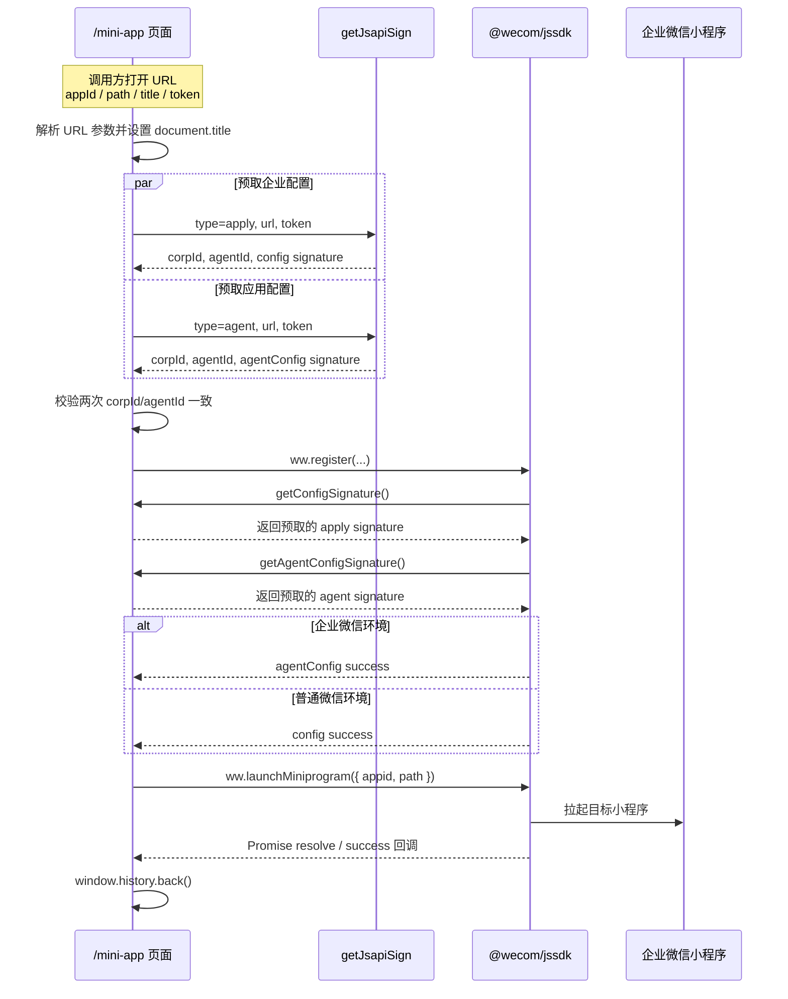

---
{"dg-publish":true,"permalink":"/02-web/knowledge-map/","dg-note-properties":{"cssclasses":["wiki-page","wiki-project"]}}
---


# knowledge-map

[[01-导航与索引/项目总览\|项目总览]] / Web 端项目

> [!abstract] 项目定位
> 企业微信小程序跳转过渡页：预取两类签名、注册 JS-SDK，再拉起目标小程序。

> [!wiki-nav] 本页导航
> [[02-Web端项目/knowledge-map#页面入口\|页面入口]] · [[02-Web端项目/knowledge-map#URL 参数\|URL 参数]] · [[02-Web端项目/knowledge-map#签名接口\|签名接口]] · [[02-Web端项目/knowledge-map#初始化与跳转时序\|跳转时序]] · [[02-Web端项目/knowledge-map#调试与排错\|排错]] · [[02-Web端项目/knowledge-map#已知风险\|验收边界]]

## 快速启动

```bash
# 安装依赖
yarn install

# 启动开发服务器
yarn start:dev

# Node.js 22 构建旧版 Webpack/Umi
NODE_OPTIONS=--openssl-legacy-provider yarn build

# 代码检查
yarn eslint src/pages/MiniApp/wecom.ts src/pages/MiniApp/index.tsx src/services/api.ts
```

构建产物目录为 `build/`。`/mini-app` 路由使用 hash 模式且关闭布局和登录校验，页面入口为 `/#/mini-app`。

## 项目信息

- **项目名称**：knowledge-map
- **项目类型**：Web 前端应用
- **本地路径**：`/Users/dompling/WebstormProjects/Work/knowledge-map`
- **包名与版本**：`ant-design-pro@5.2.0`
- **当前分支**：`dev`
- **远程仓库**：`https://gitlab.jncapp.cn/jnc-infrastructure/knowledge-map.git`
- **主要能力**：企业微信内通过过渡页拉起关联小程序

## 技术栈

- **框架**：React `^17.0.0`、Umi `^3.5.0`
- **UI 库**：Ant Design `^4.24.0`、Ant Design Pro Layout `^6.35.0`
- **语言**：TypeScript（声明版本 `^4.5.0`，本地安装编译器为 4.9.5）
- **企业微信 SDK**：`@wecom/jssdk@^2.4.2`
- **路由与构建**：Umi hash 路由、Webpack 5 配置、输出目录 `build`

## 项目结构

| 路径 | 职责 |
| --- | --- |
| `src/pages/MiniApp/index.tsx` | 页面生命周期、动态标题、调试面板、初始化与跳转编排 |
| `src/pages/MiniApp/wecom.ts` | URL 参数解析、签名预取、SDK 注册、小程序拉起 |
| `src/pages/MiniApp/styles.less` | 跳转页和调试面板样式 |
| `src/services/api.ts` | `getJsapiSign` 请求与响应类型 |
| `config/routes.ts` | `/mini-app` 路由，`layout: false` |
| `src/utils/config.ts` | `/mini-app` 免登录配置 |

## 核心功能模块

- `/mini-app` 过渡页：读取调用方 URL，显示加载状态并拉起目标小程序。
- 企业微信 JS-SDK：通过 `@wecom/jssdk` 的 `ww.register` 和 `ww.launchMiniprogram` 完成配置与跳转。
- 调试面板：`debug=1` 时显示签名请求、配置回调和拉起结果，`token` 只记录掩码。

## 企业微信小程序跳转

### 目标

在企业微信客户端打开知识地图的 `/mini-app` 过渡页，前端使用 URL 中的业务参数调用签名接口，从接口响应取得 `corpId`、`agentId` 和两类 JS-SDK 签名，完成 `@wecom/jssdk` 注册后拉起目标小程序。

> [!abstract] 当前设计结论
> `getConfigSignature` 和 `getAgentConfigSignature` 仍必须作为 `ww.register` 的属性保留，这是 `@wecom/jssdk` 的注册契约。实际网络请求已经移到注册前：页面先并行预取 `apply`、`agent` 两类签名及 `corpId/agentId`，校验两次返回的企业与应用标识一致后再调用 `ww.register`。两个 SDK 回调只返回已预取的签名，不再发起网络请求。

## 页面入口

项目使用 hash 路由，推荐入口格式：

```text
https://<knowledge-map-host>/#/mini-app?appId=<小程序AppID>&path=<小程序页面路径>&title=<页面标题>&token=<临时令牌>
```

启用调试面板：

```text
https://<knowledge-map-host>/#/mini-app?appId=<小程序AppID>&path=<小程序页面路径>&title=<页面标题>&token=<临时令牌>&debug=1
```

如果参数值包含中文或其他特殊字符，调用方必须先进行 URL 编码。

## URL 参数

参数同时支持 hash query 和普通 query。发生同名参数冲突时，代码优先读取 hash query。

| 业务字段 | 接受的参数名 | 必填 | 示例 | 用途 |
| --- | --- | --- | --- | --- |
| 小程序 AppID | `appId`、`appid`、`miniAppId`、`miniProgramAppId`、`VITE_WECOM_MINI_APP_ID` | 是 | `wx1234567890abcdef` | 传给 `ww.launchMiniprogram` 的 `appid` |
| 小程序路径 | `path`、`miniPath`、`miniProgramPath`、`VITE_WECOM_MINI_PATH` | 否 | `pages/home/index?id=100` | 传给 `ww.launchMiniprogram` 的 `path`；为空时打开小程序默认首页 |
| 页面标题 | `title` | 否 | `知识地图` | 动态设置浏览器 `document.title`；离开页面时恢复原标题 |
| 签名令牌 | `token` | 是 | `<temporary-token>` | 传给 `getJsapiSign`，用于后端识别或鉴权本次签名请求 |
| 调试开关 | `debug` | 否 | `1` | 值为 `1` 时展示 MiniApp 调试面板 |

> [!warning] token 安全要求
> `token` 当前通过 URL 进入页面，并作为签名接口 query 参数发送。它可能出现在浏览器历史、反向代理访问日志、服务端请求日志和问题截图中。调用方应使用短时、单用途、可撤销的临时 token；禁止使用长期 access token，并避免在调试日志中输出原值。前端调试信息只展示掩码。

### 不再由 URL 提供的字段

以下字段已从 URL 配置中移除，改为由 `getJsapiSign` 响应提供：

| 字段 | 来源 | 校验 |
| --- | --- | --- |
| `corpId` | `getJsapiSign.data.corpId` | 不得为空；`apply` 与 `agent` 两次响应必须一致 |
| `agentId` | `getJsapiSign.data.agentId` | 转换后必须是大于 0 的整数；两次响应必须一致 |

## 签名接口

### 请求

```http
GET /sfa/gateway/third/api/third/qywx/getJsapiSign
```

| 参数 | 类型 | 必填 | 当前值或规则 |
| --- | --- | --- | --- |
| `agentKey` | `string` | 是 | 前端固定传 `portal` |
| `type` | `apply \| agent` | 是 | `apply` 用于企业配置签名；`agent` 用于应用配置签名 |
| `url` | `string` | 是 | 当前固定为 `window.location.origin + window.location.pathname`，不包含普通 query 和 hash |
| `token` | `string` | 是 | URL 中传入的临时令牌 |

正常初始化会并行发送两次请求：

1. `type=apply`
2. `type=agent`

### 响应

```ts
type JsapiSignData = {
  noncestr: string;
  timestamp: string;
  url: string;
  signature: string;
  corpId: string;
  agentId: string | number;
};
```

| 字段 | 类型 | 必填 | 前端用途 |
| --- | --- | --- | --- |
| `noncestr` | `string` | 是 | 映射为 SDK 需要的 `nonceStr` |
| `timestamp` | `string` | 是 | SDK 签名时间戳 |
| `url` | `string` | 建议 | 后端参与签名的 URL；应与请求 URL 一致 |
| `signature` | `string` | 是 | JS-SDK SHA-1 签名结果 |
| `corpId` | `string` | 是 | 传给 `ww.register.corpId` |
| `agentId` | `string \| number` | 是 | 转为正整数后传给 `ww.register.agentId` |

外层响应使用项目的 `API.Response<T>` 结构，前端会读取 `code`、`msg` 和 `data`。

## 初始化与跳转时序



### 签名 URL 与缓存规则

- 两类签名请求使用同一个 `signatureUrl`：`window.location.origin + window.location.pathname`。
- 对 hash 路由入口，`/#/mini-app?...` 中的 `#/mini-app` 和业务参数都不参与签名。
- `getConfigSignature` 固定返回预取的 `apply` 签名。
- `getAgentConfigSignature` 固定返回预取的 `agent` 签名。
- 当前实现没有在 SDK 回调阶段补发签名请求；后端签名 URL 必须与上述前端规则保持一致。

## SDK 注册参数

```ts
ww.register({
  corpId,
  agentId,
  jsApiList: ['launchMiniprogram'],
  getConfigSignature,
  getAgentConfigSignature,
  onConfigSuccess,
  onConfigFail,
  onConfigComplete,
  onAgentConfigSuccess,
  onAgentConfigFail,
  onAgentConfigComplete,
});
```

关键约束：

- 当前过渡页只申请 `launchMiniprogram` 权限。
- `corpId` 和 `agentId` 来自签名接口，不再信任调用方 URL。
- 企业微信环境等待 `agentConfig` 成功后才视为注册完成。
- 普通微信环境在 `config` 成功后完成。
- 非微信/企业微信浏览器只用于 `debug=1` 观察请求；SDK 回调不会完整模拟。
- 注册等待超过 15 秒时按超时失败处理；页面调试总流程超过 30 秒会显示额外提示。

## 小程序拉起参数

```ts
ww.launchMiniprogram({
  appid: miniProgramAppId,
  path: miniProgramPath,
  success() {
    window.history.back();
  },
});
```

| 参数 | 来源 | 说明 |
| --- | --- | --- |
| `appid` | URL `appId` 及其别名 | 必填，目标小程序 AppID |
| `path` | URL `path` 及其别名 | 可选，小程序内部页面路径及参数 |
| `success` | 前端固定回调 | 拉起成功后执行 `window.history.back()` |

## 调试与排错

在 URL 中加入 `debug=1` 后，页面展示下列信息：

- 是否处于企业微信环境。
- URL 参数是否完整，敏感字段只显示掩码。
- `apply`、`agent` 两次签名请求的开始、响应状态和字段长度。
- 签名接口返回的 `corpId/agentId`。
- `config`、`agentConfig` 成功、失败、完成回调。
- `launchMiniprogram` 返回结果或异常。

### 常见失败检查顺序

1. URL 是否包含非空 `appId` 和 `token`。
2. `getJsapiSign` 是否同时支持 `type=apply` 与 `type=agent`。
3. 两次响应是否都包含 `noncestr`、`timestamp`、`signature`、`corpId`、`agentId`。
4. 两次响应的 `corpId/agentId` 是否一致。
5. 签名接口使用的 URL 是否与 SDK 回调 URL 完全一致。
6. `agentId` 对应应用是否与生成 `agent` 签名使用的 access token 属于同一应用。
7. 当前域名是否配置为该企业微信应用的可信域名。
8. 目标小程序是否属于当前企业并已经关联工作台。

### 本地与远程分支表

| 分支                    | 类型        | HEAD      | 上游/映射                      | 相对 `dev`                   | 最近提交                            |
| --------------------- | --------- | --------- | -------------------------- | -------------------------- | ------------------------------- |
| `dev`                 | 本地集成分支    | `3426d88` | `origin/dev`，当前一致          | 基准                         | Merge `jyy/企业微信跳转` into `dev`   |
| `origin/dev`          | 远程跟踪      | `3426d88` | —                          | 与本地 `dev` 一致               | 同上                              |
| `prod_release`        | 本地发布分支    | `83a1051` | `origin/prod_release`，当前一致 | 落后 `dev` 8，领先 0            | `feat(pages): mini-app 小程序跳转`   |
| `origin/prod_release` | 远程跟踪      | `83a1051` | —                          | 落后 `dev` 8，领先 0            | 同上                              |
| `uat`                 | 本地 UAT 分支 | `ddbab0f` | `origin/uat`，当前一致          | 与 `dev` 分叉：独有 2，`dev` 独有 8 | Merge `prod_release` into `uat` |
| `origin/uat`          | 远程跟踪      | `ddbab0f` | —                          | 与 `dev` 分叉：独有 2，`dev` 独有 8 | 同上                              |
| `master`              | 本地主分支     | `c790b88` | `origin/master`，当前一致       | 落后 `dev` 10，领先 0           | `图标更换`                          |
| `origin/master`       | 远程默认分支    | `c790b88` | `origin/HEAD` 指向它          | 落后 `dev` 10，领先 0           | 同上                              |

> [!warning] 分支用途说明
> `dev`、`uat`、`prod_release`、`master` 的职责是按分支命名和现有提交关系推断的，仓库内没有发现正式发布流程说明。合并或发布前应再核对团队约定和 Jenkins 流水线配置。

## 已知风险

> [!warning] 企业微信环境仍需验收
> 浏览器构建通过不能证明企业微信可信域名、应用 `agentId`、签名 access token 和目标小程序关联关系正确。发布前必须在真实企业微信客户端完成 `config`、`agentConfig` 和 `launchMiniprogram` 全链路验证。

- `token` 位于 URL 与签名请求 query 中，必须由调用方控制生命周期并避免复用。
- 页面签名 URL 固定排除 query/hash；后端若采用不同规范会导致签名校验失败。
- `npm run tsc` 仍受既有依赖语法与 OAReport JSX 错误影响，不能作为本次功能的通过证据。
- 分支快照没有执行 `git fetch`，只代表 2026-08-25 本地已有远程跟踪引用。

## 更新日志

- **2026-08-25**：新增 `/mini-app` 企业微信小程序跳转文档；记录动态 `title`、必填 `token`、接口返回 `corpId/agentId`、注册前并行预取签名、`@wecom/jssdk` 用法与完整本地分支快照。

## 相关链接

[[01-导航与索引/项目总览#技术栈\|技术栈]]

- [企业微信 JS-SDK npm 包](https://www.npmjs.com/package/@wecom/jssdk)

## 标签

#维护中 #React-17 #UmiJS-3 #AntDesign #TypeScript #企业微信 #小程序 #JS-SDK
