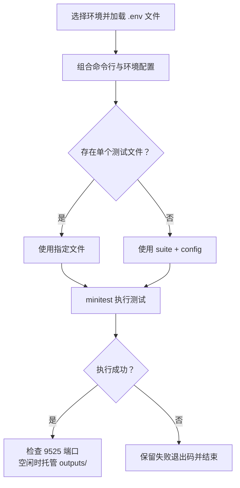

---
{"dg-publish":true,"permalink":"/03/wechat-test/","dg-note-properties":{"cssclasses":["wiki-page","wiki-project"]}}
---


# wechatTest

[[01-导航与索引/项目总览\|项目总览]] / 小程序项目

> [!abstract] 项目定位
> 基于微信 Minium / `minitest` 的小程序自动化测试项目，支持 dev、uat、prod 多环境运行，并可生成和托管测试报告。

> [!wiki-nav] 本页导航
> [[03-小程序项目/wechatTest#快速启动\|运行参数]] · [[03-小程序项目/wechatTest#环境配置\|环境]] · [[03-小程序项目/wechatTest#测试执行流程\|执行流程]] · [[03-小程序项目/wechatTest#当前测试结构\|用例目录]] · [[03-小程序项目/wechatTest#相关项目\|关联项目]]

## 项目信息

- **项目名称**：wechatTest
- **项目类型**：微信小程序自动化测试工具
- **开发状态**：#维护中
- **语言**：Python
- **测试框架**：Minium / minitest
- **项目路径**：`<工作区>/wechatTest`

## 快速启动

```bash
# 默认使用 uat 环境
python3 run.py

# 指定环境
python3 run.py --env dev
python3 run.py --env uat
python3 run.py --env prod

# 指定测试套件与 Minium 配置
python3 run.py --suite config/tpm-suite.json --config config/config.json

# 指定单个测试文件
python3 run.py --file <test-file>

# 启用 GUI
python3 run.py --gui
```

测试成功结束后，启动器会检查本机 `9525` 端口，并在端口空闲时用 Python HTTP Server 托管 `outputs/` 报告目录。测试失败时直接返回失败退出码，不启动报告服务。

## 环境配置

项目提供三套环境文件：

- `.env.dev`
- `.env.uat`
- `.env.prod`

主要配置项：

- `MINI_SUITE` - 测试套件 JSON
- `MINI_CONFIG` - Minium 配置 JSON
- `MINI_FILE` - 指定单个测试文件
- `MINI_GUI` - 是否启用图形界面

`config/config.json` 维护待测小程序构建目录、微信开发者工具 CLI 路径和 Minium 运行参数。

## 测试执行流程

`run.py` 默认加载 `.env.uat`。`--suite`、`--config`、`--file` 优先使用命令行传值，再读取对应环境变量；指定单个测试文件时优先执行该文件，否则必须同时提供 suite 和 config。



以上顺序核对自 `run.py`（2026-09-21）。环境文件不存在或测试参数不完整时，启动器会提前退出；端口已占用时仅保留现有服务，需自行确认该服务是否指向本项目报告目录。

## 当前测试结构

```text
wechatTest/
├── run.py
├── config/
│   ├── config.json
│   └── tpm-suite.json
├── tests/
│   ├── base/TPM/
│   │   ├── base.py
│   │   └── login.py
│   └── pages/TPM/
│       └── banquet_report_test.py
├── outputs/
├── .env.dev
├── .env.uat
└── .env.prod
```

当前 `tpm-suite.json` 指向 TPM 宴席报表自动化测试用例。

## 相关项目

- [[03-小程序项目/jnc-dms-wx\|jnc-dms-wx]] - `config/config.json` 当前用于配置小程序构建目录
- [[03-小程序项目/tpm-evidence-audit-wxapp\|tpm-evidence-audit-wxapp]] - TPM 小程序项目，可复用当前 TPM 测试基础封装

## 更新日志

| 日期 | 描述 |
|------|------|
| 2026-09-15 | 补充到 Work Projects Wiki |

## 标签

#小程序 #自动化测试 #Python #Minium #微信开发者工具 #维护中

## 相关链接

[[09-问题与记录/问题记录\|问题记录]]
