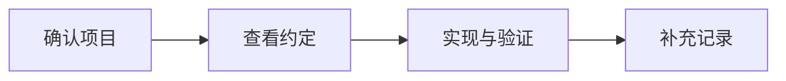

---
{"dg-publish":true,"dg-permalink":"dev-standards","permalink":"/dev-standards/","dg-note-properties":{"permalink":"/dev-standards/","cssclasses":["wiki-page","wiki-article"]}}
---


# 开发规范

[[01-导航与索引/项目总览\|项目导航]] / 研发规范

统一文件命名、模块位置和日常开发顺序。开始前先从 [[01-导航与索引/项目总览\|项目导航]] 确认目标项目与版本，再使用对应框架的约定。

> [!wiki-nav] 本页导航
> [[06-研发规范/开发规范#开发流程\|开发流程]] · [[06-研发规范/开发规范#代码规范\|命名约定]] · [[06-研发规范/开发规范#项目结构\|目录结构]]

## 开发流程



| 当前步骤 | 使用入口 |
| --- | --- |
| 确认技术版本与项目关系 | [[01-导航与索引/项目总览#技术栈\|技术栈]] · [[01-导航与索引/项目关系图\|项目关系图]] |
| 查框架和目录约定 | [[06-研发规范/React项目规范\|React项目规范]] · [[06-研发规范/Umi项目开发指南\|Umi项目开发指南]] |
| 复用常见实现 | [[06-研发规范/常用代码片段\|常用代码片段]] |
| 排查并沉淀问题 | [[09-问题与记录/常见问题解决方案\|常见问题解决方案]] · [[09-问题与记录/问题记录\|问题记录]] |

## 代码规范

### 命名规范

#### 文件命名

- **组件文件**：PascalCase（如 `UserProfile.tsx`）
- **工具文件**：camelCase（如 `formatDate.ts`）
- **常量文件**：UPPER_SNAKE_CASE（如 `API_CONFIG.ts`）
- **样式文件**：与组件同名（如 `UserProfile.module.less`）

#### 变量命名

下面展示命名方式；组件体中的 `...` 是省略标记，需要替换为实际实现。

```typescript
// 常量 - UPPER_SNAKE_CASE
const MAX_COUNT = 100;
const API_BASE_URL = 'https://api.example.com';

// 普通变量 - camelCase
const userName = 'John';
const isVisible = true;

// 组件 - PascalCase
const UserCard = () => { ... };

// 私有变量 - 下划线前缀
const _internalState = {};
```

## 项目结构

### Web 项目标准结构

按职责查找代码时可参考下列结构。已有项目沿用自身目录，不为匹配示例新建空目录；Umi 的路由和运行时位置见 [[06-研发规范/Umi项目开发指南#常用约定\|Umi 配置入口]]。

```text
project/
├── src/
│   ├── components/      # 公共组件
│   ├── pages/           # 页面
│   ├── services/        # API 服务
│   ├── utils/           # 工具函数
│   ├── hooks/           # 自定义 Hooks
│   ├── store/           # 状态管理
│   ├── constants/       # 常量
│   ├── types/           # TypeScript 类型
│   ├── styles/          # 全局样式
│   └── assets/          # 静态资源
├── public/              # 公共资源
├── config/              # 配置文件
└── tests/               # 测试文件
```

## 标签

#开发规范 #最佳实践

## 相关链接

[[07-运维与发布/通用/Git分支规范\|分支与提交约定]] · [[08-知识库指南/知识库主动调用指南\|如何查证项目事实]]
