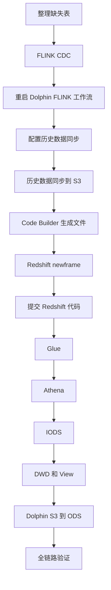

---
{"dg-publish":true,"dg-permalink":"cashpool-add-tables","permalink":"/cashpool-add-tables/","dg-note-properties":{"permalink":"/cashpool-add-tables/"}}
---

# 额度池新增缺失表处理流程

> [!info] 适用场景
> 额度池项目新增或补齐表，需要同时处理 FLINK CDC 增量链路、历史数据同步、Athena / Redshift 建表、Glue、Dolphin 工作流等。

## 整体处理流程



> [!important] 特殊处理
> `dealer_info` 还需要处理「离线数据获取」和 `dealer_info_all_history专用` 工作流；主副经销商相关表需要额外检查驼峰命名在 Redshift 洗数阶段的兼容性。

## 1. 先整理本次缺失表清单

开始操作前，先把本次需要新增的表统一整理好，例如：

```text
table_a
table_b
table_c
```

后续所有步骤都以这份表清单为准，避免漏表。

建议同时确认：

- 是否都属于额度池库
- 是否都需要 CDC
- 是否都有 `id` 字段
- 是否需要特殊 `sort_key`
- 是否需要特殊 `search_query`
- 是否需要不同的并行度 / `page_size`

---

## 2. FLINK 项目补 CDC 增量链路

### 2.1 从 dev 分支切功能分支

进入 FLINK 项目：

```bash
git checkout dev
git pull
git checkout -b feature/cashpool-add-tables
```

### 2.2 补上缺失表

按照项目现有方式，把本次缺失的表补到 CDC 配置 / 代码中。

完成后：

```bash
git add .
git commit -m "feat: add cashpool cdc tables"
git push
```

然后提 MR / PR：

```text
目标分支：dev
```

等待合并、部署。

---

## 3. 重启 Dolphin 中的 FLINK 工作流

进入 DolphinScheduler 后，按页面顶部菜单进入：

```text
头部菜单栏：项目管理
  ↓
FLINK 项目
  ↓
工作流定义
  ↓
搜索 cashPool-ri
  ↓
下线
  ↓
等待工作流完全停止
  ↓
上线
```

> [!tip] 操作路径
> `项目管理 → FLINK 项目 → 工作流定义 → 搜索 cashPool-ri`
>
> 确认找到的是 `cashPool-ri` 后再执行 下线 / 上线，避免操作错工作流。

目的：

- 重新加载新增 CDC 表配置
- 确认新增表的增量链路已经生效

### 完成标准

- `cashPool-ri` 正常运行
- 新增表 CDC 已加载
- 没有明显异常日志

---

## 4. 在 db_sync_config 中补历史数据配置

数据库：

```text
tpm_report_dev
```

配置表：

```text
db_sync_config
```

建议不要直接手写整条 `INSERT VALUES`，而是找一条同库、同类型、已经正常使用的配置作为模板，然后用 `INSERT ... SELECT` 复制。

例如额度池现有模板：

```text
id = 156
table_name = cash_pool_consume_log
database_name = jnc_tpm_cashpool_uat
database_name_map = jnc_tpm_cashpool
ods_name = tpm_mysql
```

---

## 5. 推荐的 SQL 新增方式

### 5.1 单表新增

假设新增表：

```text
xxx_new_table
```

执行：

```sql
INSERT INTO tpm_report_dev.db_sync_config (
    driver_version,
    db_url,
    db_user,
    db_password,
    ods_name,
    database_name,
    database_name_map,
    table_name,
    table_name_map,
    column_lower_case,
    s3_lower_case,
    sort_key,
    search_query,
    parallelism,
    page_size,
    out_file_type,
    need_send_email,
    email_urls,
    need_call,
    receiver_phone_numbers,
    enable_status
)
SELECT
    driver_version,
    db_url,
    db_user,
    db_password,
    ods_name,
    database_name,
    database_name_map,
    'xxx_new_table',
    table_name_map,
    column_lower_case,
    s3_lower_case,
    sort_key,
    search_query,
    parallelism,
    page_size,
    out_file_type,
    need_send_email,
    email_urls,
    need_call,
    receiver_phone_numbers,
    enable_status
FROM tpm_report_dev.db_sync_config
WHERE id = 156;
```

这里不要手动写：

```text
id
created_at
updated_at
```

让数据库自动生成。

插入后获取新增 ID：

```sql
SELECT LAST_INSERT_ID();
```

---

### 5.2 多表新增

如果一次新增多张表，可以连续执行多条 `INSERT ... SELECT`。

例如：

```sql
INSERT INTO tpm_report_dev.db_sync_config (
    driver_version,
    db_url,
    db_user,
    db_password,
    ods_name,
    database_name,
    database_name_map,
    table_name,
    table_name_map,
    column_lower_case,
    s3_lower_case,
    sort_key,
    search_query,
    parallelism,
    page_size,
    out_file_type,
    need_send_email,
    email_urls,
    need_call,
    receiver_phone_numbers,
    enable_status
)
SELECT
    driver_version,
    db_url,
    db_user,
    db_password,
    ods_name,
    database_name,
    database_name_map,
    'table_a',
    table_name_map,
    column_lower_case,
    s3_lower_case,
    sort_key,
    search_query,
    parallelism,
    page_size,
    out_file_type,
    need_send_email,
    email_urls,
    need_call,
    receiver_phone_numbers,
    enable_status
FROM tpm_report_dev.db_sync_config
WHERE id = 156;

INSERT INTO tpm_report_dev.db_sync_config (
    driver_version,
    db_url,
    db_user,
    db_password,
    ods_name,
    database_name,
    database_name_map,
    table_name,
    table_name_map,
    column_lower_case,
    s3_lower_case,
    sort_key,
    search_query,
    parallelism,
    page_size,
    out_file_type,
    need_send_email,
    email_urls,
    need_call,
    receiver_phone_numbers,
    enable_status
)
SELECT
    driver_version,
    db_url,
    db_user,
    db_password,
    ods_name,
    database_name,
    database_name_map,
    'table_b',
    table_name_map,
    column_lower_case,
    s3_lower_case,
    sort_key,
    search_query,
    parallelism,
    page_size,
    out_file_type,
    need_send_email,
    email_urls,
    need_call,
    receiver_phone_numbers,
    enable_status
FROM tpm_report_dev.db_sync_config
WHERE id = 156;
```

全部新增完成后，统一查 ID：

```sql
SELECT
    id,
    table_name,
    created_at,
    enable_status
FROM tpm_report_dev.db_sync_config
WHERE database_name = 'jnc_tpm_cashpool_uat'
  AND table_name IN (
      'table_a',
      'table_b',
      'table_c'
  )
ORDER BY id DESC;
```

---

## 6. db_sync_config 特别检查项

模板 `id = 156` 当前：

```text
sort_key = id
parallelism = 5
page_size = 5000
out_file_type = PARQUET
enable_status = 1
```

所以“只改表名”成立的前提是：

- 新表也有 `id`
- `id` 适合作为排序字段
- 不需要特殊查询条件
- 并行度和分页大小可以沿用
- 输出仍然是 PARQUET

如果某张表没有 `id`，必须单独调整：

```sql
UPDATE tpm_report_dev.db_sync_config
SET sort_key = '实际字段名'
WHERE id = 新增ID;
```

如果需要特殊过滤条件：

```sql
UPDATE tpm_report_dev.db_sync_config
SET search_query = '你的查询条件'
WHERE id = 新增ID;
```

---

## 7. 触发历史数据同步到 S3

接口：

```text
POST
https://api-bigdata-dev.jncapp.cn/data-sync-service/sync/db
```

单个 ID：

```json
{
  "ids": [394]
}
```

多个 ID：

```json
{
  "ids": [417, 418, 419]
}
```

目的：

```text
源数据库历史数据
        ↓
db_sync_config
        ↓
data-sync-service
        ↓
S3
```

### 查询同步结果

调用同步接口后，会返回一个 `code`。这个 `code` 用来查询本次历史数据同步结果。

查询地址规则：

```text
https://api-bigdata-dev.jncapp.cn/data-sync-service
```
搜索：a13a58d6b3ef427bb80540ee5aae410d

例如返回：

```text
a13a58d6b3ef427bb80540ee5aae410d
```

> [!tip] 操作顺序
> `POST /data-sync-service/sync/db → 获取 code → 打开 /data-sync-service/ 搜索{code} → 查看同步结果`

### 执行后检查

不要直接跳到下一步，先确认：

- 同步接口正常返回 `code`
- 使用 `/data-sync-service/` 能查询到同步结果
- S3 已生成对应数据
- 数据量合理
- 文件路径正确
- 没有明显同步报错

---

## 8. 使用 Code Builder 生成相关文件

打开：

```text
https://api-bigdata-dev.jncapp.cn/code-builder/
```

### 8.1 准备 Code Builder 输入配置

打开 `flink-pipline` 项目，准备两份与额度池对应的 JSON：

- `job/tpm_mysql/tpm-mysql-jnc-tpm-cashpool-ri.json`：**Flink CDC 配置**
- `source/tpm_mysql.json`：**数据库连接配置**

先查看 job JSON 中的 `source.id`，再到 `source` 目录选择相同 `source.id` 的 JSON。本次额度池的 `source.id` 为 `tpm_mysql`，因此对应 `source/tpm_mysql.json`。

### 8.2 放入 Code Builder 并预览

将两份 JSON 分别放入 Code Builder 对应区域：

```text
job JSON → Flink CDC 配置
source JSON → 数据库连接配置
```

然后点击 **预览**。

### 8.3 检查预览结果

预览后重点确认：

- 数据库与数据库映射正确
- `source.table.list` 对应本次额度池目标表
- 本次目标表数量为 **17 张**
- 17 张表与缺失表清单一致
- 没有漏表，也没有混入无关表
- 后续需要的 `iods / dwd / dolphin / glue / Athena` 生成内容正常

本次额度池已经通过 Code Builder 成功预览并处理 **17 张表**。

### 8.4 导出生成文件

预览确认无误后：

```text
生成 / 导出 ZIP
  ↓
下载 ZIP
  ↓
解压
```

> [!tip] Code Builder 标准操作顺序
> `打开 flink-pipline → 找 job JSON → 根据 source.id 找 source JSON → 放入 Code Builder → 预览 → 核对 17 张表 → 导出 ZIP`

---

## 9. 把 Code Builder 生成内容放到 Redshift 的 newframe 目录

> [!warning] 这里不要把生成文件直接合并到 `cashpool` 原有的 `iods / dwd / glue / dolphin` 等目录。
> 正确方式是在 `cashpool` 下新建一个独立的 `newframe` 目录，把 Code Builder ZIP 解压目录里的**全部内容原样放进去**。

Redshift 额度池目录：

```text
/Users/dompling/WebstormProjects/Work/redshift/base/cashpool
```

先创建：

```text
cashpool/newframe
```

完整目标路径：

```text
/Users/dompling/WebstormProjects/Work/redshift/base/cashpool/newframe
```

然后把 Code Builder 导出的 ZIP 解压后，**解压目录中的所有内容**全部复制到 `newframe` 下。

例如解压目录为：

```text
/Users/dompling/Downloads/bigdata_scripts/
```

则最终结构应类似：

```text
cashpool/
├── ...原有目录保持不动
└── newframe/
    ├── dwd/
    ├── iods/
    ├── glue/
    ├── dolphin/
    └── ...Code Builder 解压出的其他内容
```

> [!important] 复制规则
> - 复制的是解压目录里的**内容**，不是直接覆盖 `cashpool` 原有目录。
> - 不要把生成的 `dwd` 文件直接粘到现有 `cashpool/dwd`。
> - 不要把生成的 `iods` 文件直接粘到现有 `cashpool/iods`。
> - 本批 Code Builder 生成结果统一隔离在 `cashpool/newframe` 中。
> - 保持解压后的目录层级和文件结构不变。

标准操作：

```text
Code Builder 导出 ZIP
  ↓
解压 ZIP
  ↓
Redshift/base/cashpool 下创建 newframe
  ↓
把解压目录中的全部内容复制到 newframe
  ↓
检查 newframe 内目录与文件是否完整
```

---

## 10. Redshift 项目提交代码

创建功能分支：

```bash
git checkout master
git pull
git checkout -b feature/cashpool-add-tables
```

提交：

```bash
git add .
git commit -m "feat: add cashpool tables"
git push
```

然后提 MR：

```text
目标分支：master
```

等待合并。

---

## 11. 启动 / 更新 Glue

代码合并后，通知负责同事启动或更新新增 Glue。

需要确认：

- Glue 文件已经合并
- Glue Job 已创建 / 更新
- Glue Job 能正常执行
- 没有任务失败

不要只停留在“已经通知”，最好确认任务确实正常。

---

## 12. 执行新增 Athena 表

执行 Code Builder 生成的 Athena 建表 SQL。

目标：

```text
S3
 ↓
Athena External Table
```

执行完成后检查：

```sql
SELECT *
FROM xxx
LIMIT 10;
```

确认：

- 表能查
- 字段正常
- S3 LOCATION 正确
- 有数据
- 字段类型没有明显异常

---

## 13. Redshift 创建 IODS / DWD / View

本次发版的 **6 条 IODS 建表 SQL** 已单独记录，发版时可直接打开：

[[06-运维文档/额度池发版-IODS建表SQL\|额度池发版-IODS建表SQL]]

根据生成文件创建：

```text
IODS
DWD
View
```

数据链路：

```text
S3
 ↓
Athena
 ↓
IODS
 ↓
DWD
 ↓
View
```

> [!warning] Redshift 洗数据命名注意
> Redshift 做洗数据处理时，不支持驼峰形式的表名。遇到驼峰表名时，需要先按现有规范转换或映射为非驼峰命名后再进入 Redshift 洗数链路。
>
> 本次“主副经销商”相关表就是需要特别注意的场景，后续发版或补表时要优先检查表名是否包含驼峰，避免在 Redshift 洗数据阶段失败。

建议分别验证：

```sql
SELECT COUNT(*) FROM iods.xxx;
```

```sql
SELECT COUNT(*) FROM dwd.xxx;
```

```sql
SELECT *
FROM xxx_view
LIMIT 10;
```

---

## 14. Dolphin 配置 s3->ods 工作流

进入 DolphinScheduler：

```text
项目管理
  ↓
额度池项目
  ↓
工作流定义
  ↓
s3->ods
```

本步骤的配置依据是 Code Builder 生成的：

```text
/Users/dompling/WebstormProjects/Work/redshift/base/cashpool/newframe/dolphin.sh
```

> [!important] 参数来源
> 不要手工猜字段。每张表的 `table_name / KEYS / JSON_PARSE_KEYS / NUMERIC_KEYS` 都直接以 `newframe/dolphin.sh` 对应表配置为准。

### 14.1 每张表固定使用两个节点

不需要从零创建，直接复制工作流里已经正常使用的同类型节点，再修改即可。

```text
上一张表子流程节点
       ↓
<table_name>传参     ← SHELL 节点
       ↓
<table_name>         ← 子流程节点
       ↓
下一张表传参节点
```

#### 节点 1：`<table_name>传参`

复制一个现有的“传参” SHELL 节点，主要修改：

- 节点名称：`<table_name>传参`
- 脚本保持 `echo "传参"`
- `table_name`：当前表名
- `KEYS`：当前表需要同步的完整字段列表
- `JSON_PARSE_KEYS`：需要按 JSON 解析的字段；没有则留空
- `NUMERIC_KEYS`：需要按数值类型处理的字段；没有则留空
- 前置任务：上一张表的子流程节点

`KEYS` 中通常还会包含 CDC / 分区辅助字段：

```text
_op,_ts,_binlog_file_internal,_binlog_pos_internal,dt
```

#### 节点 2：`<table_name>`

复制一个现有的子流程节点，修改：

- 节点名称：`<table_name>`
- 子节点保持：`期初和增量数据同步脚本`
- 前置任务：对应的 `<table_name>传参`

### 14.2 示例：`cash_pool_adjust_log`

`dolphin.sh` 中对应配置：

```text
table_name=cash_pool_adjust_log
KEYS=id,adjust_quantity,association_code,...,_op,_ts,_binlog_file_internal,_binlog_pos_internal,dt
JSON_PARSE_KEYS=
NUMERIC_KEYS=adjust_quantity
```

Dolphin 中配置成：

```text
rule_sku_relation
       ↓
cash_pool_adjust_log传参
       ↓
cash_pool_adjust_log
```

其中 `cash_pool_adjust_log传参` 的前置任务是 `rule_sku_relation`，`cash_pool_adjust_log` 的前置任务是 `cash_pool_adjust_log传参`。

### 14.3 本次新增表顺序

本次需要补入 `s3->ods` 的 6 张表：

```text
policy_def
cash_pool_adjust_log
dealer_cash_dj_city_relation
dealer_info
main_vice_company_relationship
city_code_city_manager_relation
```

实际串联时保持“传参节点 → 子流程节点 → 下一张表传参节点”的连续依赖关系。

例如尾部：

```text
dealer_info
  ↓
main_vice_company_relationship传参
  ↓
main_vice_company_relationship
  ↓
city_code_city_manager_relation传参
  ↓
city_code_city_manager_relation
```

### 14.4 `dealer_info` 特殊处理：补「离线数据获取」工作流

`dealer_info` 除了前面的 `s3->ods` 配置外，还需要在 Dolphin 的 **「离线数据获取」** 工作流里额外补一条离线同步链路。

这里不要从零新建，直接参考已经正常使用的 `dealer_info_all_history`，复制对应节点后只修改 `dealer_info` 相关内容。

整体结构：

```text
remove s3 dealer_info
        ↓
req_dealer_info
        ↓
resp_dealer_info
```

#### 节点 1：`remove s3 dealer_info`

复制 `remove s3 dealer_info_all_history` 的 SHELL 节点。

主要修改：

- 节点名称：`remove s3 dealer_info`
- 脚本中的表目录改为 `tpm_mysql_jnc_tpm_cashpool__dealer_info`
- 日期变量、删除命令及其他公共配置保持原节点写法不变

例如脚本中的目标目录应指向：

```text
/data/ods/tpm_mysql_jnc_tpm_cashpool__dealer_info/dt=${...}
```

#### 节点 2：`req_dealer_info`

复制 `req_dealer_info_all_history` 的 HTTP 节点。

配置：

```text
请求地址：https://${domain}/data-sync-service/sync/db
请求类型：POST
```

截图中的请求 Body 为：

```json
{
  "ids": [417, 418, 419, 420, 421]
}
```

前置任务：

```text
remove s3 dealer_info
```

> [!note] 请求 Body
> 当前已确认的截图显示这里传入的是上述 5 个 ID。是否需要进一步收敛为仅 `dealer_info` 自身对应的 ID，不能只凭截图判断；如需调整，应以该工作流的实际同步设计和生产现有模板为准。

#### 节点 3：`resp_dealer_info`

复制 `resp_dealer_info_all_history` 的 HTTP 节点。

配置：

```text
请求地址：https://${domain}/data-sync-service/sync/process-info
请求类型：GET
```

请求参数：

```text
taskCode
Parameter
${req_dealer_info}
```

校验条件：

```text
内容包含
```

校验内容：

```text
DONE
```

前置任务：

```text
req_dealer_info
```

这三个节点的作用是：

```text
清理 dealer_info 旧的 S3 离线数据
        ↓
调用 sync/db 重新触发 dealer_info 历史数据同步
        ↓
使用返回的 taskCode 查询 process-info
        ↓
直到结果包含 DONE
```

> [!important] `dealer_info` 的额外步骤
> `newframe/dolphin.sh` 主要用于前面的 `s3->ods` 参数配置；`dealer_info` 的这条「离线数据获取」链路需要额外参考 Dolphin 中现有的 `dealer_info_all_history` 工作流节点进行复制和修改。

> [!warning] 上线时不要漏掉 `dealer_info_all_history专用`
> 本次开发环境中 **`dealer_info_all_history专用` 工作流内部脚本有修改**。正式上线时除了发布 `s3->ods`、离线数据获取等新增配置外，还必须同步检查并更新生产环境中的 `dealer_info_all_history专用` 工作流，不能只上线主工作流节点。
>
> 上线前建议将开发环境与生产环境该工作流的脚本、节点参数和分支逻辑逐项对比，确认修改已同步后再执行数据链路。

### 14.5 保存前检查

配置完后先不要急着运行，逐个检查：

- 6 张新增表是否全部存在
- 每张表是否都有“传参 + 子流程”两个节点
- 参数是否来自当前 `newframe/dolphin.sh`
- `KEYS` 是否复制完整，没有漏字段或串到其他表
- `JSON_PARSE_KEYS / NUMERIC_KEYS` 是否与生成文件一致
- 每个子流程是否仍为 `期初和增量数据同步脚本`
- 前置任务是否首尾连续，没有断链或接错表

确认无误后点击 **保存**。

---

## 15. 最终验证

最后做一次端到端校验。

### 增量链路

```text
源库新增 / 更新数据
      ↓
FLINK CDC
      ↓
后续目标链路
```

确认新增数据能够持续同步。

### 历史链路

```text
db_sync_config
      ↓
sync API
      ↓
S3
      ↓
Athena
      ↓
IODS
      ↓
DWD
      ↓
View
```

确认历史数据完整。

---

# 最终完整流程

```text
整理缺失表
   ↓
FLINK 从 dev 切分支
   ↓
补 CDC 表
   ↓
提交并合并 dev
   ↓
Dolphin → 项目管理 → FLINK 项目 → 工作流定义 → cashPool-ri
   ↓
下线 → 上线
   ↓
tpm_report_dev.db_sync_config
   ↓
使用 INSERT ... SELECT 克隆模板配置
   ↓
修改 table_name
   ↓
确认 sort_key / search_query 等参数
   ↓
查询新增 ID
   ↓
POST /data-sync-service/sync/db
   ↓
确认历史数据进入 S3
   ↓
Code Builder 生成
iods / dwd / dolphin / glue / Athena
   ↓
导出 ZIP
   ↓
在 Redshift/base/cashpool 下创建 newframe
   ↓
把 Code Builder 解压目录的全部内容放入 newframe
   ↓
提交 MR → master
   ↓
启动 Glue
   ↓
执行 Athena 建表
   ↓
Redshift 创建 IODS
   ↓
创建 DWD
   ↓
创建 View
   ↓
Dolphin 配置 s3->ods
   ↓
把所有缺失表加入工作流
   ↓
全链路验证
```

---

# 操作检查表

| 阶段 | 操作 | 完成标准 |
|---|---|---|
| 1 | 整理缺失表 | 有完整表清单 |
| 2 | FLINK CDC | dev 切分支并补表 |
| 3 | Git | 合并到 dev |
| 4 | Dolphin FLINK | cashPool-ri 下线 → 上线 |
| 5 | db_sync_config | SQL 克隆模板配置 |
| 6 | 配置检查 | sort_key / search_query 正确 |
| 7 | 获取 ID | 已拿到新增 ID |
| 8 | 历史同步 | POST sync/db |
| 9 | S3 检查 | 历史数据已落 S3 |
| 10 | Code Builder | ZIP 已生成 |
| 11 | Redshift 项目 | cashpool 下创建 newframe，并放入 Code Builder 解压目录的全部内容 |
| 12 | Git | MR → master |
| 13 | Glue | Job 正常 |
| 14 | Athena | 新表可查询 |
| 15 | Redshift | IODS / DWD / View 已创建 |
| 16 | Dolphin | s3->ods 已配置 |
| 17 | 最终验证 | 历史 + 增量都正常 |

---

# 最重要的两个原则

## 1. 历史和增量是两条链路

```text
历史数据：
db_sync_config + sync API

增量数据：
FLINK CDC
```

两边都必须正常，不能只完成其中一条。

## 2. db_sync_config 优先用模板克隆

推荐：

```sql
INSERT ... SELECT
```

不推荐直接复制完整：

```sql
INSERT ... VALUES (...旧ID...)
```

这样可以避免：

- ID 冲突
- `created_at` / `updated_at` 写成旧时间
- 漏字段
- 手动复制错误
