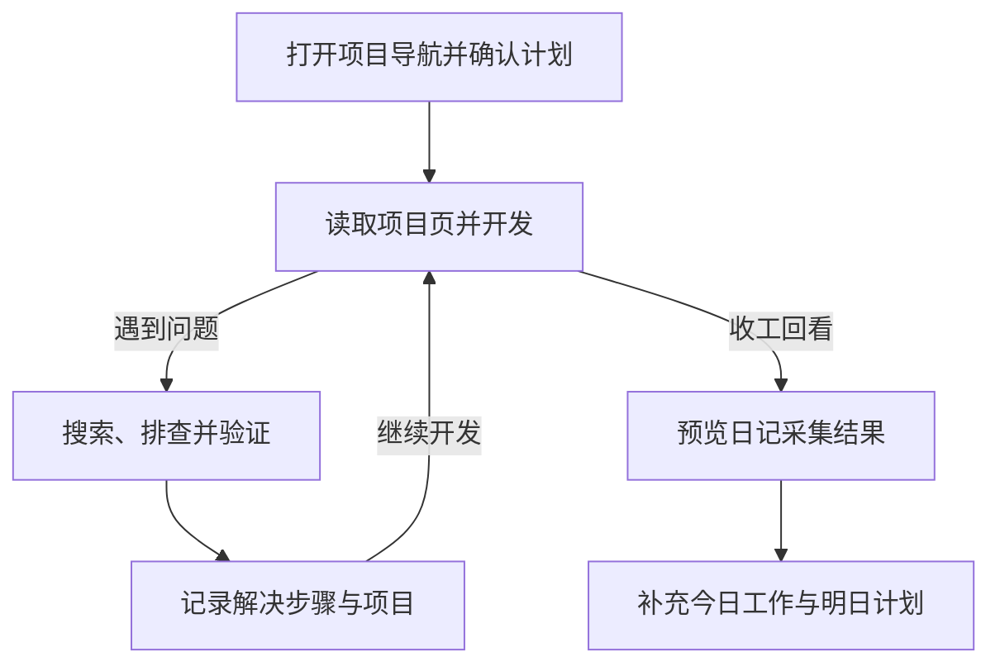

---
{"dg-publish":true,"dg-permalink":"workflow-guide","permalink":"/workflow-guide/","dg-note-properties":{"permalink":"/workflow-guide/","cssclasses":["wiki-page","wiki-article"]}}
---


# 优化工作流程指南

[[01-导航与索引/项目总览\|项目导航]] / 知识库指南 / 工作流程

把项目查询、开发排查和知识记录连起来。日常入口见下表；详细配置与旧脚本按需展开，现有工具的安装和参数统一见 [[scripts/README\|知识库工具脚本]]。

> [!wiki-nav] 本页导航
> [[08-知识库指南/优化工作流程指南#每日工作流程\|日常使用]] · [[08-知识库指南/优化工作流程指南#Claude Code 集成工作流\|助手协作]] · [[08-知识库指南/优化工作流程指南#快捷操作配置\|快捷操作]] · [[08-知识库指南/优化工作流程指南#自动化脚本\|脚本示例]] · [[08-知识库指南/优化工作流程指南#Alfred/Raycast 集成（Mac 用户）\|系统搜索]] · [[08-知识库指南/优化工作流程指南#工作流程检查清单\|检查清单]]

| 要做的事 | 当前入口 | 使用条件 |
| --- | --- | --- |
| 找项目、启动和切换 | [[01-导航与索引/项目总览\|项目总览]] → 项目页 | 按项目实际版本与命令执行 |
| 搜索已有解决方法 | [[09-问题与记录/常见问题解决方案\|常见问题解决方案]]、[[09-问题与记录/问题记录\|问题记录]] | Obsidian 全文搜索即可 |
| 记录已解决的问题 | QuickAdd「记一笔问题」或 `kb-add` | 插件配置或脚本安装完成 |
| 汇总当天工作 | `kb-daily --print` → `kb-daily` | 脚本当前采集 7 个已映射项目 |
| 新增项目页 | QuickAdd「新建项目文档」 | 选对应平台目录，补充实际信息 |

## 日常工作流程图



问题排查贯穿开发过程；收工时统一回看记录并补充日记，入口见 [[01-导航与索引/项目维护\|项目维护]]。

## 每日工作流程

下面四个时机对应上方入口。标题里的时间用于安排节奏，实际耗时取决于项目与问题；无需在每次切换时重复安装或配置工具。

### 1. 早上开始工作（5 分钟）

> [!example]- 开始工作时检查什么
> #### 步骤 1：打开 Obsidian 项目导航
> 打开 [[01-导航与索引/项目总览\|项目总览]]，从 [[01-导航与索引/项目维护\|项目维护]] 查看升级任务和待补信息。
>
> #### 步骤 2：创建今日日记（可选）
> 使用 QuickAdd「今日日记」或 [[templates/每日日记模板\|每日日记模板]]，写下今天的项目和目标。已经手写日记时，`kb-daily --print` 可提供补充材料。
>
> #### 步骤 3：找到目标项目
> 打开项目页，核对快速启动中的运行环境、命令和访问地址。

### 2. 切换项目时（30 秒）

在 Obsidian 用 `Cmd/Ctrl + O` 输入项目名；命令和依赖以项目页及源码为准。

#### 使用 Claude Code（推荐）

让助手读取目标项目页后再给启动信息，例如「切换到 andromeda-web，核对启动条件」。助手需能访问知识库及项目目录，具体交互见 [[08-知识库指南/优化工作流程指南#场景 4：项目切换\|#场景 4：项目切换]]。

> [!example]- 已配置 Shell 函数后可用的快捷命令
> 以下 `kb-start`、`kb-search`、`kb-open` 来自 [[08-知识库指南/优化工作流程指南#脚本 1：项目启动助手\|#脚本 1：项目启动助手]] 的可选示例，仓库未提供同名独立命令。
> ```bash
> # 显示启动信息
> kb-start
>
> # 搜索问题
> kb-search "npm install"
>
> # 打开项目文档
> kb-open
> ```

### 3. 遇到问题时（即时）

#### 第一步：搜索知识库

用 `Cmd/Ctrl + Shift + F` 搜索报错关键词，再按 [[09-问题与记录/常见问题解决方案#排查顺序\|排查顺序]] 核对版本和复现条件。历史命令需先确认适用于当前问题。

#### 第二步：如果没找到，解决后记录

使用 [[templates/问题记录模板\|问题记录模板]]、QuickAdd 或 `kb-add`，写明问题、解决步骤、验证结果和项目标签。也可让助手按 [[08-知识库指南/知识库主动调用指南#问题记录流程\|记录约定]] 整理已经验证的结果。

### 4. 下班前（3 分钟）

#### 更新今日日记（可选）

先用 `kb-daily --print` 看采集结果；没有当日日记时再生成，已有日记则手动补入。补充完成的工作、问题和明天计划，脚本不会自动提炼结论。

#### 检查问题记录

查看 [[09-问题与记录/问题记录\|问题记录]] 的计数，达到 50 条时整理归档。`kb-add` 只发出提醒，归档说明见 [[08-知识库指南/优化工作流程指南#脚本 2：自动归档问题记录\|#脚本 2：自动归档问题记录]]。

> [!example]- 旧归档命令示例 · 对应脚本尚未提供
> 以下命令仅在自行适配并创建脚本后可用，详见 [[08-知识库指南/优化工作流程指南#自动化脚本\|#自动化脚本]]。
> ```bash
> # 归档问题记录
> cd "${KB_ROOT:?请先设置 KB_ROOT}"
> ./scripts/archive-problems.sh
> ```

## Claude Code 集成工作流

以下是请求助手完成任务的用法，前提是助手能读取当前知识库；切换目录、安装插件或运行脚本本身不会自动触发这些对话。事实核对顺序统一见 [[08-知识库指南/知识库主动调用指南\|知识库主动调用指南]]。

### 场景 1：启动项目

请求「启动 tpm-pc-manager」时，先读项目页和依赖文件，确认 Node 版本、安装方式、启动命令及访问地址，再执行需要的步骤。

### 场景 2：查找历史问题

提供完整报错和复现条件。先查 [[09-问题与记录/问题记录\|问题记录]] 与 [[09-问题与记录/常见问题解决方案\|常见问题解决方案]]，没有匹配项时继续排查，解决后保留验证结果。

### 场景 3：记录问题

请求「记录一下」时同时给出项目、问题与有效方案；助手可按现有格式整理到 [[09-问题与记录/问题记录\|问题记录]]，然后核对项目标签和记录计数。

### 场景 4：项目切换

切换工作目录后，明确告诉助手目标项目并读取该项目文档。示例：

```bash
cd "${WORK_ROOT:?请先设置 WORK_ROOT}/andromeda-web"
```

## 快捷操作配置

插件用途与仓库保存的配置见 [[08-知识库指南/Obsidian插件配置指南\|Obsidian插件配置指南]]。优先检查已有 Choice；快捷键和菜单名称以当前插件版本为准。

### 配置 QuickAdd 插件

#### 步骤 1：安装 QuickAdd

在设置的第三方插件列表中检查 QuickAdd 是否启用。当前仓库已保存「记一笔问题」「今日日记」「新建项目文档」三个 Choice。

#### 步骤 2：配置快捷操作

「记一笔问题」使用 Capture，目标为 `09-问题与记录/问题记录.md`；另外两个使用 Template。具体模板与输出目录见 [[08-知识库指南/Obsidian插件配置指南#QuickAdd\|QuickAdd 当前配置]]。

> [!example]- 旧版 Macro 操作示意
> 这是原有配置思路；当前仓库使用上方 Capture / Template 配置，菜单与步骤需按安装版本确认。
> 1. 设置 → QuickAdd → Manage Macros。
> 2. 添加「记录问题」Macro。
>
> ```text
> 1. User Input: "问题简述"
> 2. User Input: "问题描述"
> 3. User Input: "解决方案"
> 4. Template: templates/问题记录模板.md
> 5. Create Note: 问题记录.md (append)
> ```

#### 使用：

从命令面板运行对应 QuickAdd Choice；可在设置 → 快捷键中按习惯绑定 `Cmd/Ctrl + Shift + P`。新增记录后检查目标文件、日期标题和计数。

### 配置 Commander 插件（可选）

#### 安装 Commander

Commander 未列入当前启用清单；需要工具栏按钮时，可在第三方插件中安装并启用。

#### 添加自定义按钮

在 Commander 中选择已有命令：打开项目导航、记录问题、全局搜索或今日日记。命令需先可用，图标按个人习惯设置。

## 自动化脚本

当前仓库提供的命令是 `scripts/kb-add` 与 `scripts/kb-daily`，安装和参数说明见 [[scripts/README\|知识库工具脚本]]。

> [!info] 下列脚本是保留的配置示例
> `archive-problems.sh` 和 `quick-doc.sh` 尚未作为脚本文件提供。示例中仍有旧的 `问题记录.md`、`07-问题库` 路径，实际记录位置为 `09-问题与记录/问题记录.md`；使用前需适配目录。
>
> Shell 简化版 `kb-add` 与现有脚本的参数不同；同名函数会影响命令解析。下列内容供适配参考，当前工具范围以 [[scripts/README\|脚本说明]] 为准。

### 脚本 1：项目启动助手

包含启动信息、搜索、打开文档、记录和统计函数。使用前核对项目目录名、`## 快速启动` 标题和本机 Shell 工具；旧搜索与记录函数仍指向根目录 `问题记录.md`，统计函数会把说明标题也计入总数。

> [!example]- 展开操作与示例
> 创建 `~/.zshrc` 或 `~/.bashrc` 别名：
>
> ```bash
> # 知识库相关命令
> export KB_ROOT="<知识库目录>"
>
> # 快速查看项目启动信息
> kb-start() {
>     local project=$(basename $(pwd))
>     local doc=$(find "$KB_ROOT" -name "${project}.md" 2>/dev/null | head -1)
>
>     if [ -n "$doc" ]; then
>         echo "[知识库] $project 启动信息"
>         echo ""
>         sed -n '/^## 快速启动$/,/^## /p' "$doc" | head -n -1
>     else
>         echo "[错误] 当前项目不在知识库中"
>     fi
> }
>
> # 快速搜索问题记录
> kb-search() {
>     if [ -z "$1" ]; then
>         echo "用法: kb-search <关键词>"
>         return 1
>     fi
>
>     echo "[搜索] 知识库：$1"
>     echo ""
>     grep -i --color=always -n "$1" "$KB_ROOT/问题记录.md"
> }
>
> # 快速打开项目文档
> kb-open() {
>     local project=$(basename $(pwd))
>     local doc=$(find "$KB_ROOT" -name "${project}.md" 2>/dev/null | head -1)
>
>     if [ -n "$doc" ]; then
>         open "$doc"
>     else
>         echo "[错误] 当前项目不在知识库中"
>     fi
> }
>
> # 快速添加问题记录（简化版）
> kb-add() {
>     if [ -z "$1" ]; then
>         echo "用法: kb-add '问题简述' '解决方案'"
>         return 1
>     fi
>
>     local project=$(basename $(pwd))
>     local date=$(date +"%Y-%m-%d")
>     local time=$(date +"%H:%M")
>
>     cat >> "$KB_ROOT/问题记录.md" <<EOF
>
> ## $date - $1
>
> **问题描述：**
> $2
>
> **解决方案：**
> $3
>
> **相关项目：** $project
>
> **标签：** #$project
>
> 记录时间：$date $time
>
> ---
> EOF
>
>     echo "[成功] 已添加到问题记录"
> }
>
> # 查看知识库统计
> kb-stats() {
>     echo "[统计] 知识库"
>     echo ""
>     echo "项目文档："
>     find "$KB_ROOT" -name "*.md" -path "*/02-Web端项目/*" | wc -l | xargs echo "  Web 端："
>     find "$KB_ROOT" -name "*.md" -path "*/03-小程序项目/*" | wc -l | xargs echo "  小程序："
>     find "$KB_ROOT" -name "*.md" -path "*/04-移动端项目/*" | wc -l | xargs echo "  移动端："
>     find "$KB_ROOT" -name "*.md" -path "*/05-文档项目/*" | wc -l | xargs echo "  文档项目："
>     find "$KB_ROOT" -name "*.md" -path "*/10-后端与数据项目/*" | wc -l | xargs echo "  后端与数据："
>     echo ""
>     echo "问题记录："
>     grep -c "^## " "$KB_ROOT/09-问题与记录/问题记录.md" | xargs echo "  总计："
> }
> ```
>
> **使用示例：**
> ```bash
> # 显示当前项目启动信息
> kb-start
>
> # 搜索问题
> kb-search "npm install"
>
> # 打开项目文档
> kb-open
>
> # 快速添加问题
> kb-add "问题标题" "问题描述" "解决方案"
>
> # 查看统计
> kb-stats
> ```


### 脚本 2：自动归档问题记录

按 50 条阈值复制并重置记录的旧示例。它统计所有二级标题，随后只保留原文件前 10 行，会丢失当前工具依赖的「问题列表」、分隔线与计数；使用前需重写路径、计数与保留逻辑。当前归档应按 [[09-问题与记录/问题记录#记录与归档\|记录与归档说明]] 整理。

> [!example]- 展开操作与示例
> 创建 `scripts/archive-problems.sh`：
>
> ```bash
> #!/bin/bash
> # 自动归档问题记录
>
> KB_ROOT="${KB_ROOT:?请先设置 KB_ROOT}"
> PROBLEMS="$KB_ROOT/问题记录.md"
> ARCHIVE_DIR="$KB_ROOT/07-问题库"
> DATE=$(date +"%Y-%m")
>
> # 创建归档目录
> mkdir -p "$ARCHIVE_DIR"
>
> # 计算问题数量
> count=$(grep -c "^## " "$PROBLEMS")
>
> if [ "$count" -ge 50 ]; then
>     echo "[归档] 问题记录已达 $count 条，开始归档..."
>
>     # 备份到归档
>     cp "$PROBLEMS" "$ARCHIVE_DIR/问题记录-$DATE.md"
>
>     # 清空主文件（保留标题）
>     head -n 10 "$PROBLEMS" > "$PROBLEMS.tmp"
>     mv "$PROBLEMS.tmp" "$PROBLEMS"
>
>     echo "[成功] 已归档到: $ARCHIVE_DIR/问题记录-$DATE.md"
>     echo "[成功] 问题记录已重置"
> else
>     echo "[统计] 当前问题记录数：$count/50"
>     echo "未达到归档阈值"
> fi
> ```
>
> **使用：**
> ```bash
> chmod +x scripts/archive-problems.sh
> ./scripts/archive-problems.sh
> ```


### 脚本 3：项目文档快速生成

固定生成 Web 项目的旧示例。当前各平台建档入口是 [[templates/新建项目文档\|新建项目文档模板]]。

> [!example]- 展开操作与示例
> 创建 `scripts/quick-doc.sh`：
>
> ```bash
> #!/bin/bash
> # 快速生成项目文档框架
>
> if [ -z "$1" ]; then
>     echo "用法: ./quick-doc.sh <项目名>"
>     exit 1
> fi
>
> PROJECT=$1
> KB_ROOT="${KB_ROOT:?请先设置 KB_ROOT}"
> DOC_FILE="$KB_ROOT/02-Web端项目/$PROJECT.md"
>
> # 检查是否已存在
> if [ -f "$DOC_FILE" ]; then
>     echo "[警告] 文档已存在：$DOC_FILE"
>     exit 1
> fi
>
> # 生成文档框架
> cat > "$DOC_FILE" <<EOF
> # $PROJECT
>
> > 项目简介
>
> ---
>
> ## 快速启动
>
> \`\`\`bash
> # Node 版本
> Node 16.x+
>
> # 安装依赖
> npm install
>
> # 启动命令
> npm run dev
>
> # 访问地址
> http://localhost:3000
> \`\`\`
>
> ---
>
> ## 项目信息
>
> - **项目名称**：$PROJECT
> - **项目类型**：Web 前端应用
> - **开发状态**：#维护中
> - **项目路径**：\`<工作区>/$PROJECT\`
>
> ---
>
> ## 技术栈
>
> 待补充...
>
> ---
>
> ## 标签
>
> #前端 #Web端 #维护中
>
> ---
>
> ## 相关链接
>
> - [[项目总览#技术栈|技术栈]]
> - [[01-导航与索引/项目总览\|项目总览]]
> - [[项目关系图]]
> EOF
>
> echo "[成功] 已创建文档：$DOC_FILE"
> echo "[提示] 请在 Obsidian 中打开并补充详细信息"
> ```
>
> **使用：**
> ```bash
> chmod +x scripts/quick-doc.sh
> ./scripts/quick-doc.sh "new-project-name"
> ```


## Alfred/Raycast 集成（Mac 用户）

在系统启动器中搜索知识库的可选配置，尚未随仓库安装。替换实际知识库目录后，在对应启动器内配置；Alfred 示例先输出匹配文件路径，多个结果如何选择取决于后续 Workflow 配置。

### Alfred Workflow

> [!example]- 展开操作与示例
> **功能：** 快速搜索和打开项目文档
>
> #### 步骤 1：创建 Workflow
>
> 1. 打开 Alfred Preferences
> 2. Workflows → 点击 "+"
> 3. 选择 "Blank Workflow"
> 4. 名称：Knowledge Base
>
> #### 步骤 2：添加脚本
>
> **Keyword Input：**
> - Keyword: `kb`
> - Argument: Required
>
> **Run Script：**
> ```bash
> query="{query}"
> kb_root="<知识库目录>"
>
> # 搜索项目文档
> results=$(find "$kb_root" -name "*$query*.md" -type f)
>
> # 输出结果
> echo "$results"
> ```
>
> **Open File：**
> - 用 Obsidian 打开找到的文件
>
> #### 使用：
> ```
> Alfred → 输入 "kb andromeda" → 回车打开文档
> ```


### Raycast Extension

> [!example]- 展开操作与示例
> **功能：** 快速搜索知识库
>
> #### 步骤 1：安装 Raycast Script Commands
>
> ```bash
> # 创建脚本目录
> mkdir -p ~/Documents/Raycast/Scripts
>
> # 创建搜索脚本
> cat > ~/Documents/Raycast/Scripts/kb-search.sh <<'EOF'
> #!/bin/bash
>
> # Required parameters:
> # @raycast.schemaVersion 1
> # @raycast.title Search Knowledge Base
> # @raycast.mode fullOutput
>
> # Optional parameters:
> # @raycast.argument1 { "type": "text", "placeholder": "搜索关键词" }
>
> kb_root="<知识库目录>"
> query="$1"
>
> echo "[搜索] 知识库：$query"
> echo ""
>
> # 搜索项目文档
> find "$kb_root" -name "*.md" -type f -exec grep -l "$query" {} \; | while read file; do
>     echo "[文件] $(basename "$file")"
>     grep -n --color=never "$query" "$file" | head -3
>     echo ""
> done
> EOF
>
> chmod +x ~/Documents/Raycast/Scripts/kb-search.sh
> ```
>
> #### 步骤 2：在 Raycast 中导入
>
> 1. 打开 Raycast
> 2. Extensions → Script Commands
> 3. 添加脚本目录
>
> #### 使用：
> ```
> Raycast → 输入 "Search Knowledge Base" → 输入关键词
> ```


## 工作流程对比

### 优化前 vs 优化后

#### 场景：切换项目并启动

把分散的环境和命令整理到项目页，切换时从 [[01-导航与索引/项目总览\|项目总览]] 直达，再核对源码中的实际版本。

#### 场景：遇到问题

先搜索已有记录，复现并验证后应用；没有匹配记录时，把有效步骤补入 [[09-问题与记录/问题记录\|问题记录]]，供下次检索。

#### 场景：新项目启动

使用 [[templates/新建项目文档\|新建项目文档模板]] 建档，按 [[08-知识库指南/维护计划/知识库更新计划#新增项目时的检查顺序\|检查顺序]] 补导航和关联。具体耗时随项目变化。

## 工作流程检查清单

清单中的“仪表板”指 [[01-导航与索引/项目总览\|项目导航]]。按实际维护节奏使用。

### 每日检查

- [ ] 早上打开仪表板
- [ ] 查看今天要处理的项目
- [ ] 遇到问题先搜索知识库

### 每周检查

- [ ] 检查问题记录数量
- [ ] 更新常用项目文档
- [ ] 清理过时信息

### 每月检查

- [ ] 归档问题记录（如果 ≥50 条）
- [ ] 补充新项目文档
- [ ] 优化搜索和标签

## 效率提升目标

用可检查的结果回看使用效果；没有耗时统计时，不预设提升百分比。

### 短期目标（1 周）

能从项目导航找到常用项目，完成一次问题记录和日记预览。

### 中期目标（1 个月）

补齐常用项目的启动条件，检查新增记录是否能通过项目名和关键词检索。

### 长期目标（3 个月）

复查记录是否被复用、启动说明是否过时；需要衡量耗时时，先保留同类任务的实际记录。

## 总结

### 核心原则

从项目页定位上下文，按 [[08-知识库指南/知识库主动调用指南\|事实源顺序]] 核对，执行后补充经过验证的记录。

### 黄金组合

| 工具 | 作用 |
| --- | --- |
| Obsidian | 项目导航、全文搜索与笔记维护 |
| Claude Code | 在可读取资料的前提下协助排查和整理 |
| `kb-add` / `kb-daily` | 保存问题与生成日记骨架 |
| Alfred / Raycast | 按需配置的系统搜索入口 |

维护步骤见 [[08-知识库指南/维护计划/知识库更新计划\|知识库更新计划]]。
