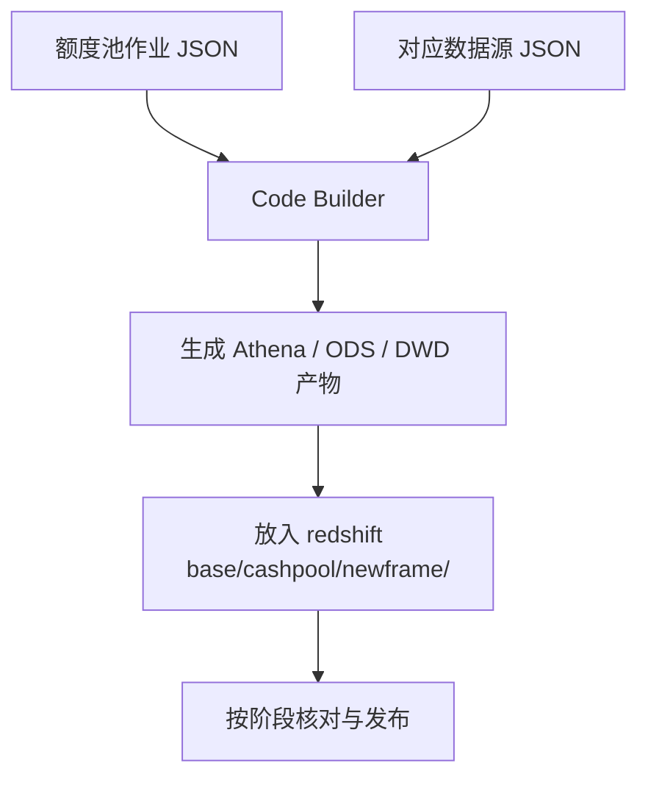

---
{"dg-publish":true,"permalink":"/10/flink-pipline/","tags":["后端与数据","Flink","Python","数据平台"],"dg-note-properties":{"type":"project","platform":"后端与数据","stack":"Flink CDC · Python 3 · JSON","cssclasses":["wiki-page","wiki-project"],"created":"2026-09-21","updated":"2026-09-21","tags":["后端与数据","Flink","Python","数据平台"]}}
---


# flink-pipline

[[01-导航与索引/项目总览\|项目总览]] / 后端与数据项目

> [!abstract] Flink CDC 作业配置入口
> 保存数据同步作业的参数、数据源配置入口与部署配套文件。额度池等业务从这里提供 CDC 配置，后续数仓产物进入 [[10-后端与数据项目/redshift\|redshift]]。

> [!wiki-nav] 本页导航
> [[10-后端与数据项目/flink-pipline#配置之间的契约\|配置契约]] · [[10-后端与数据项目/flink-pipline#主要目录\|目录]] · [[10-后端与数据项目/flink-pipline#本地检查与辅助工具\|本地工具]] · [[10-后端与数据项目/flink-pipline#关联项目与运维入口\|运维入口]] · [[10-后端与数据项目/flink-pipline#核实范围与待补项\|核实边界]]

## 项目信息

| 项目 | 已核实内容 |
| --- | --- |
| 仓库名称 | `flink-pipline`，保留仓库原有拼写 |
| 项目类型 | 数据平台 / CDC 工作流配置 |
| 本地路径 | `/Users/dompling/WebstormProjects/Work/flink-pipline` |
| Git 仓库 | [big-data/flink-pipline](https://gitlab.jncapp.cn/big-data/flink-pipline.git) |
| 主要文件 | JSON、Python、YAML |
| 版本边界 | 当前仓库未提供统一依赖清单；Flink / CDC 运行版本待从部署环境核实 |
| 本次建档 | 2026-09-21 补入知识库；不代表仓库创建日期 |

## 主要目录

| 路径 | 用途 |
| --- | --- |
| `job/` | 按业务源分组的作业 JSON，包括 TPM、DMS、SFA、PMS、MDM 等 |
| `job/mysql-common.json` | MySQL 作业共用参数 |
| `job/mongodb-common.json` | MongoDB 作业共用参数 |
| `source/` | 按数据源 ID 命名的连接配置；本页只记录文件定位规则 |
| `create-glue.py` | 读取作业配置，生成 Glue Crawler 创建脚本 |
| `pod.yaml` | 部署配套文件；实际使用方式需结合运行环境核实 |

## 配置之间的契约

1. 作业 JSON 文件名应与 `job.name` 一致。README 明确说明，不一致会导致 Dolphin 部署失败。
2. `source.id` 对应 `source/<source.id>.json`。业务作业引用 ID，连接细节由对应数据源配置提供。
3. `job/` 保留作业独有参数；Flink 共用参数和数据源参数在部署阶段组合。
4. `database.name.map`、`table.name.map` 与 `source.table.list` 参与 Glue 目标路径生成，调整映射时需要核对下游数仓对象。

额度池的文件入口：

- 作业：`job/tpm_mysql/tpm-mysql-jnc-tpm-cashpool-ri.json`。
- 数据源配置：`source/tpm_mysql.json`。
- 后续产物：[[10-后端与数据项目/redshift\|redshift]] 的 `base/cashpool/newframe/`。

### 额度池配置到数仓产物

作业与数据源 JSON 一起作为 Code Builder 输入，生成产物后再进入数仓发布步骤：



完整操作顺序见 [[07-运维与发布/专项/额度池/额度池新增缺失表处理流程\|额度池新增缺失表处理流程]]；本页继续说明配置契约和本地生成工具。

> [!note] 配置维护边界
> README 将共用参数、数据源配置和部署文件交由对应维护人员管理。日常业务变更应先定位具体作业，避免把共用配置复制进每个作业。

## 本地检查与辅助工具

在项目根目录使用 Python 3；`create-glue.py` 只使用标准库。

```bash
cd /Users/dompling/WebstormProjects/Work/flink-pipline
python3 create-glue.py --help
python3 -m json.tool job/tpm_mysql/tpm-mysql-jnc-tpm-cashpool-ri.json > /dev/null
```

生成开发环境的 Glue 脚本：

```bash
python3 create-glue.py \
  --job-file job/tpm_mysql/tpm-mysql-jnc-tpm-cashpool-ri.json \
  --name cashpool \
  --env dev
```

输出为 `glue/cashpool_dev.sh`。生成器读取本地 JSON 并写入脚本，不会执行 AWS 命令。生成内容需要核对目标环境、角色与表映射后，交由对应发布流程处理。

> [!warning] 环境参数必须显式填写
> 生成器的 `--env` 默认值为 `prod`。本页示例显式使用 `--env dev`，避免把默认生产配置当成本地开发配置。

## 关联项目与运维入口

| 入口 | 关系与使用场景 |
| --- | --- |
| [[10-后端与数据项目/redshift\|redshift]] | 数仓下游；额度池流程以本仓库 JSON 为 Code Builder 输入，产物落入数仓目录 |
| [[07-运维与发布/专项/额度池/额度池新增缺失表处理流程\|额度池新增缺失表处理流程]] | 已记录作业 JSON、数据源 JSON、Code Builder 与数仓产物的衔接步骤 |
| [[07-运维与发布/专项/额度池/额度池发版-IODS建表SQL\|额度池发版-IODS建表SQL]] | 额度池下游建表脚本入口 |
| [[07-运维与发布/专项/额度池/额度池上线变更清单\|额度池上线变更清单]] | 本次业务发布范围和需同步对象的记录入口 |

运行完整链路还依赖 Flink CDC 部署环境、对应数据库、对象存储、Glue / Athena 和 Dolphin 调度。仓库本身没有可独立启动的 Web 应用。

## 核实范围与待补项

- 已核对 README、目录、生成器源码、命令帮助与额度池作业 JSON 语法。
- 未启动 CDC、创建 Glue 对象或操作远程数据服务。
- README 提到 `flink-job.py`，当前仓库顶层没有此文件；不要据此补写部署命令。
- 运行时版本、实际部署入口和各环境参数仍需结合部署平台核实。

## 来源与更新

| 证据 | 支撑内容 |
| --- | --- |
| [README.md](/Users/dompling/WebstormProjects/Work/flink-pipline/README.md) | 仓库用途、文件命名、配置分层与维护边界 |
| [create-glue.py](/Users/dompling/WebstormProjects/Work/flink-pipline/create-glue.py) | CLI 参数、环境默认值和本地脚本生成行为 |
| [[07-运维与发布/专项/额度池/额度池新增缺失表处理流程\|额度池新增缺失表处理流程]] | 与 Code Builder、Redshift 的实际业务衔接 |

| 日期 | 更新记录 |
| --- | --- |
| 2026-09-21 | 首次建档，补充配置契约、额度池关联、工具使用与核实边界。 |
