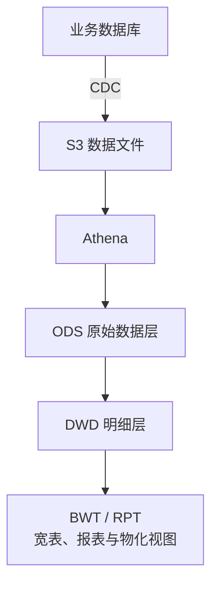

---
{"dg-publish":true,"permalink":"/10/redshift/","tags":["后端与数据","数据仓库","SQL","Python","数据平台"],"dg-note-properties":{"type":"project","platform":"后端与数据","stack":"Amazon Redshift · SQL · Python 3.9+","cssclasses":["wiki-page","wiki-project"],"created":"2026-09-21","updated":"2026-09-21","tags":["后端与数据","数据仓库","SQL","Python","数据平台"]}}
---


# redshift

[[01-导航与索引/项目总览\|项目总览]] / 后端与数据项目

> [!abstract] 数据仓库与报表加工仓库
> 汇集业务数据接入、数仓分层 SQL、报表产物和发布辅助工具。主链路从数据库 CDC 经 S3 / Athena 进入 ODS、DWD，再形成宽表与报表。

> [!wiki-nav] 本页导航
> [[10-后端与数据项目/redshift#数据链路\|数据链路]] · [[10-后端与数据项目/redshift#主要目录\|目录]] · [[10-后端与数据项目/redshift#额度池入口\|额度池]] · [[10-后端与数据项目/redshift#本地工具与前置条件\|本地工具]] · [[10-后端与数据项目/redshift#核实范围与待补项\|核实边界]]

## 项目信息

| 项目 | 已核实内容 |
| --- | --- |
| 项目类型 | 数据平台 / 数仓 SQL 与作业脚本 |
| 本地路径 | `/Users/dompling/WebstormProjects/Work/redshift` |
| Git 仓库 | [big-data/redshift](https://gitlab.jncapp.cn/big-data/redshift.git) |
| 核心技术 | Amazon Redshift、SQL、Python、S3、Athena / Glue、Dolphin 调度 |
| Python 要求 | 发布与配置辅助工具的 README 标明 Python 3.9+ |
| Python 依赖 | 按工具使用 `PyYAML`、`redshift_connector`、`boto3`；未见仓库根目录统一版本锁定 |
| 本次建档 | 2026-09-21 补入知识库；运行环境状态尚未核验 |

## 数据链路

README 记录的主链路如下，DIM 维度视图和各层作业职责见下表。



| 阶段 | 仓库负责的内容 |
| --- | --- |
| 数据库 → S3 | CDC 配置衔接、EMR 启动脚本与 Dolphin 任务登记 |
| S3 → Athena → ODS | 建表、增量加载 SQL、JSON 参数与 Python 作业 |
| ODS → DWD | 明细层建表、增量合并与删除逻辑 |
| DIM | 维度视图 |
| DWD → BWT / RPT | 宽表、报表及物化视图依赖和刷新任务 |

README 要求共用加工脚本通过 `${catalog}` 等参数区分环境；建表与外部资源仍需按各阶段要求核对目标环境。

## 主要目录

| 路径 | 用途 |
| --- | --- |
| `base/` | 按业务域保存数据加工产物，如 `cashpool`、`settlement`、`policy_center`、`ea`、`dms` |
| `report/` | 按业务域保存报表相关 SQL 与脚本 |
| `helpers/deploy-helper/` | 分析 Redshift 对象下游依赖，按顺序复制 SQL 文件 |
| `helpers/config-deploy/` | 将业务 JSON 映射并上传到对象存储；支持预览模式 |
| `helpers/mv-refresh/` | 根据物化视图依赖生成刷新 SQL 顺序 |
| `script/` | Athena、DWD、BWT、RPT 文件生成及任务辅助脚本 |
| `util/`、`role/` | 公共 SQL 工具与数据权限相关逻辑 |
| `uml/`、`dolphin/`、`docs/` | 模型图、调度说明与数据规范 |

## 额度池入口

`base/cashpool/newframe/` 已包含 `athena/`、`ods/`、`dwd/`、`glue.sh` 和 `dolphin.sh`。

现有运维笔记明确记录：从 [[10-后端与数据项目/flink-pipline\|flink-pipline]] 选择额度池作业与对应数据源 JSON，交给 Code Builder；生成产物完整放入 `base/cashpool/newframe/`，再按阶段核对和发布。

- [[07-运维与发布/专项/额度池/额度池新增缺失表处理流程\|额度池新增缺失表处理流程]]：完整链路与文件落位。
- [[07-运维与发布/专项/额度池/额度池发版-IODS建表SQL\|额度池发版-IODS建表SQL]]：对应 `base/cashpool/newframe/ods/create/` 的建表记录。
- [[07-运维与发布/专项/额度池/额度池上线变更清单\|额度池上线变更清单]]：实际发布范围、特殊对象与验证重点。

“17 张表”“6 条 IODS 建表 SQL”属于已有额度池批次记录，不是整个仓库的固定规模。

## 本地工具与前置条件

仓库没有统一的应用启动或构建命令。按具体工具准备 Python 环境和依赖后，可先查看帮助：

```bash
cd /Users/dompling/WebstormProjects/Work/redshift
python3 helpers/deploy-helper/release.py --help
python3 helpers/config-deploy/deploy_configs.py --help
python3 helpers/mv-refresh/refresh_mvs.py --help
```

| 工具 | 输入与行为 | 前置条件 |
| --- | --- | --- |
| `release.py --config <本地配置路径>` | 查询依赖，复制有序 SQL 到 `output/<config_id>/ordered_sql`，不执行业务 SQL | `PyYAML`、`redshift_connector`、可查询元数据的 Redshift 连接 |
| `refresh_mvs.py --config <本地配置路径>` | 生成按依赖排序的刷新 SQL 文件，不执行刷新 | `PyYAML`、`redshift_connector`、Redshift 元数据访问 |
| `deploy_configs.py --config <本地配置路径> --env dev --dry-run` | 预览本地 JSON 到对象存储的映射，不上传文件 | `boto3`、`PyYAML`、对应业务配置与本地目录 |

`deploy_configs.py` 在预览分支前也会创建 S3 客户端，可能读取本机 AWS 凭据链；不能把 `--dry-run` 理解为完全不依赖 AWS 环境。没有该参数时会覆盖上传，本页只提供预览用法。

完整数据链路还依赖业务数据库、对象存储、Glue / Athena、Redshift，以及相应 EMR / Flink / Dolphin 环境。服务版本与可用性未通过本次文档整理验证。

## 配置定位

| 配置入口 | 记录方式 |
| --- | --- |
| `helpers/config-deploy/configs/` | 按业务选择 YAML，核对本地目录与环境映射 |
| `helpers/mv-refresh/mv_refresh.yaml` | 物化视图工具 README 使用的配置示例文件名 |
| `release.py` 的 `--config` 参数 | 显式指定部署依赖分析配置 |
| `base/<业务域>/`、`report/<业务域>/` 下的 JSON | 业务作业参数；结合对应加工阶段定位 |

连接参数和凭据不复制到项目页。依赖分析和物化视图工具输出的 SQL 仍需由具体发布流程执行。

## 关联项目

| 项目 | 已确认的关系 |
| --- | --- |
| [[10-后端与数据项目/flink-pipline\|flink-pipline]] | CDC 配置上游；额度池流程已明确连接两仓库的输入与产物 |
| [[10-后端与数据项目/tpm-report-export\|tpm-report-export]] | 同属报表数据链路，服务声明 Redshift JDBC 并实现报表查询导出；具体环境和表级依赖按报表核对 |
| [[02-Web端项目/jnc-report-web\|jnc-report-web]] | 报表展示与导出前端上下文；前端经服务 API 访问数据 |

## 核实范围与待补项

- 已核对根 README、目录结构、三个辅助工具的 README 和源码参数。
- 未安装依赖、连接数据库、上传配置或执行建表、刷新与调度任务。
- 未确认数据库引擎版本、平台版本、完整环境配置和全部业务表的依赖图。
- 工具内部参数与 README 如有差异，以当前源码为准；具体发布入口参照业务运维笔记。

## 来源与更新

| 证据 | 支撑内容 |
| --- | --- |
| [Readme.md](/Users/dompling/WebstormProjects/Work/redshift/Readme.md) | 分层链路、开发产物与平台衔接 |
| [部署辅助说明](/Users/dompling/WebstormProjects/Work/redshift/helpers/deploy-helper/readme.md) | 有序 SQL 复制、Python 要求与依赖 |
| [配置部署源码](/Users/dompling/WebstormProjects/Work/redshift/helpers/config-deploy/deploy_configs.py) | CLI 参数、预览分支与上传行为 |
| [物化视图刷新说明](/Users/dompling/WebstormProjects/Work/redshift/helpers/mv-refresh/readme.md) | 依赖排序与 SQL 文件输出 |

| 日期 | 更新记录 |
| --- | --- |
| 2026-09-21 | 首次建档，补充分层结构、工具边界、额度池入口和跨项目关系。 |
