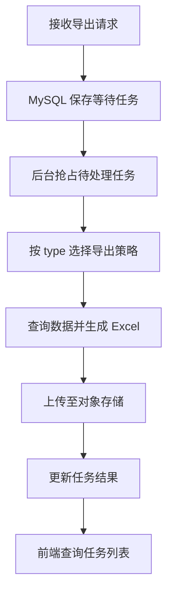

---
{"dg-publish":true,"permalink":"/10/tpm-report-export/","tags":["后端与数据","Java","SpringBoot","Maven","TPM系列","报表"],"dg-note-properties":{"type":"project","platform":"后端与数据","stack":"Java 8 · Spring Boot 2.3.12 · Maven","cssclasses":["wiki-page","wiki-project"],"created":"2026-09-21","updated":"2026-09-21","tags":["后端与数据","Java","SpringBoot","Maven","TPM系列","报表"]}}
---


# tpm-report-export

[[01-导航与索引/项目总览\|项目总览]] / 后端与数据项目

> [!abstract] TPM 报表异步导出服务
> 接收导出任务、按报表类型调用查询策略，生成 Excel 并返回文件下载入口。覆盖客情、结算、额度池、宴会、直播审核及其他业务报表。

> [!wiki-nav] 本页导航
> [[10-后端与数据项目/tpm-report-export#主要模块与执行流程\|导出流程]] · [[10-后端与数据项目/tpm-report-export#接口与前后端契约\|接口契约]] · [[10-后端与数据项目/tpm-report-export#本地构建与运行前置条件\|构建与运行]] · [[10-后端与数据项目/tpm-report-export#配置定位\|配置]] · [[10-后端与数据项目/tpm-report-export#核实范围与待补项\|核实边界]]

## 项目信息

| 项目 | 已核实内容 |
| --- | --- |
| 项目类型 | Java 后端 / 报表导出服务 |
| 本地路径 | `/Users/dompling/WebstormProjects/Work/tpm-report-export` |
| Git 仓库 | [big-data/tpm-report-export](https://gitlab.jncapp.cn/big-data/tpm-report-export.git) |
| Maven 坐标 | `cn.jncapp.tpm.report:jnc-report-export-service:0.0.1-SNAPSHOT` |
| 启动类 | `cn.jncapp.tpm.report.TpmReportExportApplication` |
| 打包文件 | `target/jnc-report-export-service.jar`，由 POM 的 `finalName` 推导 |
| 本次建档 | 2026-09-21 补入知识库；不代表已验证线上部署状态 |

## 技术栈

| 技术 | POM 声明版本 / 用途 |
| --- | --- |
| Java | `1.8` |
| Spring Boot | `2.3.12.RELEASE` |
| Spring Cloud | `Hoxton.SR12` |
| Spring Cloud Alibaba | `2.2.9.RELEASE`，包含 Nacos 配置与发现依赖 |
| MyBatis Plus | `3.4.2` |
| Dynamic Datasource | `4.3.1` |
| Redshift JDBC | `2.1.0.33` |
| MySQL Connector | `8.0.30` |
| EasyExcel | `3.3.4` |
| Redis | Spring Boot Redis Starter；服务端版本未核实 |

项目还使用内部 `jnc-sts-starter`、`vms-spring-boot-starter`。构建需要能解析这些内部依赖；本页不记录仓库凭据。

## 主要模块与执行流程

| 模块 | 责任 |
| --- | --- |
| `controller/ExportController` | 创建、查询、取消导出任务 |
| `service/impl/LogRecordServiceImpl` | 在 MySQL 记录任务、抢占待处理任务、更新进度和结果 |
| `config/ExportTaskManager` | 后台轮询任务并交给执行线程；源码当前最多同时处理 5 个任务 |
| `strategy/export/ExportContext` | 注册策略，根据任务 `type` 选择具体报表导出实现 |
| `strategy/export/` | 按业务域组织导出策略，如 `cashpool`、`settlement`、`ea`、`banquet`、`dms` |
| `dao/`、`resources/mapper/` | 报表查询与 SQL 映射 |
| `model/query/`、`model/dto/excel/` | 查询条件与导出列模型 |
| `component/ExportSignFileComponent` | 导出流程复用入口 |
| `service/impl/IS3ServiceImpl` | 通过内部 `CloudFileService` 上传对象存储并生成签名下载地址 |

正常完成的任务链路：



对象存储的实际提供方由环境配置决定；`IS3Service` 的类名不能单独证明当前环境一定使用 S3。

## 接口与前后端契约

以下是控制器声明的路径，尚未叠加网关或应用上下文前缀。

| 方法 | 路径 | 用途 |
| --- | --- | --- |
| POST | `/export/add-export-task` | 创建导出任务 |
| POST | `/export/query-export-task` | 查询当前条件对应的导出任务 |
| POST | `/export/cancel-export-task` | 按 `trackId` 取消等待或处理中的任务 |
| GET | `/healthz` | 健康检查入口 |

`ExportStrategy.name()` 默认返回实现类的简单类名，`ExportContext` 使用它匹配请求中的 `type`。例如陈列费用明细对应 `DisplayFeeDetailExportService`；该类源码明确要求改名时同步前端。

> [!tip] 新增报表时一起核对
> 查询模型、Excel 列模型、Mapper、导出策略和前端 `type` 必须保持一致。README 的报表列表只是部分类型，完整实现以 `strategy/export/` 为准。

已核实 [[02-Web端项目/jnc-report-web\|jnc-report-web]] 的 `src/services/api.ts` 调用新增与查询接口，`src/services/config.ts` 使用逻辑服务名 `report-export-service`。这证明两端代码契约相对应；网关映射和实际环境联调未验证。

## 本地构建与运行前置条件

构建入口由 `pom.xml` 和 Spring Boot Maven 插件确认：

```bash
cd /Users/dompling/WebstormProjects/Work/tpm-report-export
mvn -v
mvn -DskipTests package
```

以上打包命令跳过测试；本次建档未实际执行 Maven 编译、下载依赖或启动后端。需要准备项目兼容的 JDK / Maven 及内部依赖访问条件。

运行前还需要核对 MySQL 任务库、Redshift 数据源、Redis、Nacos、内部云文件服务及业务服务配置。`application-local.yaml` 文件存在，但不能仅凭文件名认定其已与共享环境隔离。

> [!note] 启动会运行后台任务处理器
> `ExportTaskManager` 使用初始化钩子启动轮询。先确认本地数据源与配置隔离，再启动服务；本页不提供未经核实的即跑启动参数。

## 配置定位

- `src/main/resources/application.yaml`：应用配置文件。
- `src/main/resources/application-local.yaml`：本地命名的配置文件，实际内容未纳入本页。
- `src/main/resources/bootstrap.yml`：启动配置入口。
- `src/main/resources/config/`：配套资源目录。
- `src/main/resources/mapper/`：SQL 映射文件。

本页仅核对配置文件存在，不复制连接地址、账号或凭据，也不推定端口、活动 profile 与线上实例名称。

## 关联项目与业务入口

| 项目 / 文档 | 关系边界 |
| --- | --- |
| [[02-Web端项目/jnc-report-web\|jnc-report-web]] | 已核实创建与查询导出任务的前端调用契约 |
| [[10-后端与数据项目/redshift\|redshift]] | 数据仓库上下文；服务声明 Redshift 驱动并包含多业务报表查询 |
| [[02-Web端项目/tpm-pc-manager\|tpm-pc-manager]]、[[02-Web端项目/jnc-tpm-web\|jnc-tpm-web]]、[[02-Web端项目/jnc-tpm-react\|jnc-tpm-react]] | TPM 管理端业务上下文；未据此认定它们直接调用当前服务 |
| [[07-运维与发布/专项/额度池/额度池新增缺失表处理流程\|额度池新增缺失表处理流程]] | 额度池数据加工和补表流程，排查额度池报表时可回溯上游 |
| [[07-运维与发布/专项/额度池/额度池上线变更清单\|额度池上线变更清单]] | 额度池业务变更记录；导出类型和字段变化应结合实际需求核对 |

`jnc-tpm-web`、`jnc-tpm-react` 中还能找到 `upload-file/*` 导出接口，它们与本页的 `/export/*` 路径不同，需要分别核对服务归属。

## 核实范围与待补项

- 已核对 POM、启动类、控制器、任务服务、策略注册、文件服务与前端对应调用。
- 已确认陈列费用明细策略文件存在；`docs/display-fee-detail-export-plan.md` 是方案材料，最终行为应以当前实现为准。
- 未验证构建通过、数据库连接、鉴权、网关路由、真实 Excel 下载或运行时并发行为。
- 本页版本均来自依赖声明，不等同于当前线上部署版本。

## 来源与更新

| 证据 | 支撑内容 |
| --- | --- |
| [pom.xml](/Users/dompling/WebstormProjects/Work/tpm-report-export/pom.xml) | 技术版本、内部依赖、构建产物名称 |
| [ExportController.java](/Users/dompling/WebstormProjects/Work/tpm-report-export/src/main/java/cn/jncapp/tpm/report/controller/ExportController.java) | 三个导出任务接口 |
| [ExportTaskManager.java](/Users/dompling/WebstormProjects/Work/tpm-report-export/src/main/java/cn/jncapp/tpm/report/config/ExportTaskManager.java) | 后台任务执行方式 |
| [ExportStrategy.java](/Users/dompling/WebstormProjects/Work/tpm-report-export/src/main/java/cn/jncapp/tpm/report/strategy/export/ExportStrategy.java) | 导出 `type` 的默认命名契约 |
| [前端导出请求](/Users/dompling/WebstormProjects/Work/jnc-report-web/src/services/api.ts) | 创建与查询任务的调用 |

| 日期 | 更新记录 |
| --- | --- |
| 2026-09-21 | 首次建档，补充后端技术栈、导出流程、前端契约和验证边界。 |
